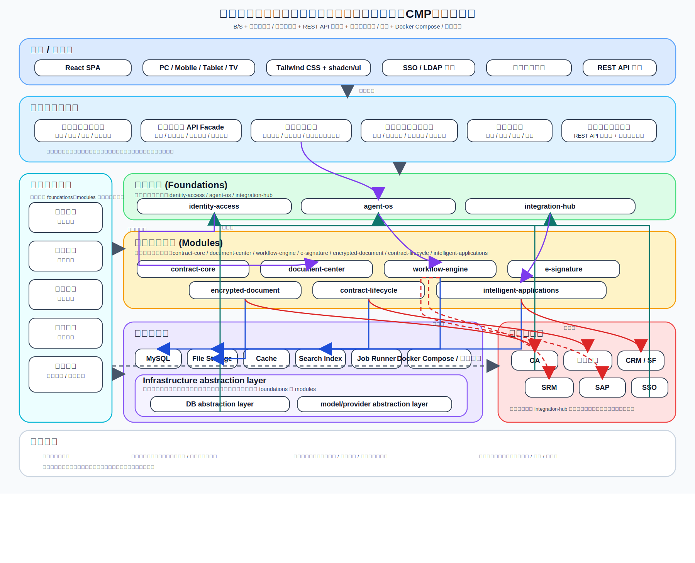

# 湖南星邦智能装备股份有限公司合同管理平台 Architecture Design

## 1. 文档说明

本文档是 `湖南星邦智能装备股份有限公司合同管理平台`（`CMP`）的总平台 `Architecture Design`，用于在 [`Requirement Spec`](../specifications/cmp-phase1-requirement-spec.md) 基础上固化总体技术架构、平台分层、核心组件边界、数据模型、集成边界与扩展策略，并为后续 [`API Design`](./api-design.md)、[`Detailed Design`](./detailed-design.md)、[`Implementation Plan`](./implementation-plan.md) 提供统一上游约束。

本文档聚焦“总平台如何构成、模块如何协作、边界如何划分”。接口字段、错误码、表级 DDL、页面交互细节、任务拆分与排期不在本文展开，应分别下沉到 [`API Design`](./api-design.md)、[`Detailed Design`](./detailed-design.md)、[`Implementation Plan`](./implementation-plan.md)。

## 2. 架构总览



`CMP` 采用 `B/S` 架构、模块化单体 / 平台化单体方案，以“平台底座 + 子模块挂载”的方式建设。前端采用 `React (SPA) + Tailwind CSS + shadcn/ui`，后端沿当前既定 `JAVA + SpringBoot + REST API` 口径实现，部署环境按 `Docker Compose / 企业内网` 收口。

整体交互以 `REST API` 为主，辅以少量异步任务 / 领域事件，用于承接耗时操作、外部回调、通知分发、索引刷新、AI 任务处理、文档中心加解密处理与归档整理等场景。当前正式口径不采用微服务拆分，不采用 `gRPC` 作为主通信协议，也不采用 `MQ` 优先架构。

### 2.1 架构目标

本文档对应的架构目标是：

- 建立一个以合同主档为核心真相源的统一平台，覆盖合同起草、审批、签署、履约、归档、检索、统计与 AI 辅助链路。
- 在一期范围内同时满足 `OA` 主审批优先与平台审批流引擎正式落地两项要求，避免审批能力被外部系统完全锁死。
- 通过平台底座统一承载组织架构、权限、流程、审计、集成、文件、AI 与数据访问能力，避免各子模块重复建设基础能力。
- 在企业内网与 `Docker Compose` 部署约束下，优先保证可交付、可运维、可扩展，而不是为未来假设场景过早引入复杂分布式拆分。
- 对数据库、AI Provider、外部审批与外围业务系统保留替换边界，降低单点技术路线对平台长期演进的绑定。

### 2.2 架构约束

本文档受以下正式约束收口：

- 项目正式名称为 `湖南星邦智能装备股份有限公司合同管理平台`，简称 `CMP`。
- 文档链路固定为 [`Requirement Spec`](../specifications/cmp-phase1-requirement-spec.md) -> [`Architecture Design`](./architecture-design.md) -> [`API Design`](./api-design.md) -> [`Detailed Design`](./detailed-design.md) -> [`Implementation Plan`](./implementation-plan.md)。
- 前端技术栈固定为 `React (SPA) + Tailwind CSS + shadcn/ui`。
- 后端技术栈沿当前既定口径固定为 `JAVA + SpringBoot + REST API`。
- 数据库交付选型固定为 `MySQL`，且基础设施层内部必须保留 `Infrastructure abstraction layer`，其中至少包含 `DB abstraction layer`。
- AI 架构在总平台层统一收口为 `Agent OS`，作为平台 AI 能力底座 / 运行时操作系统，统一承接 Agent 人格、提示词装配、工具调用、模型 / Provider 选择、运行时循环、记忆、审计与人机确认等能力；基础设施层内部的 `Infrastructure abstraction layer` 还必须包含 `model/provider abstraction layer`，更细内部组件拆解下沉到后续 AI 子模块架构与详细设计。
- 部署基线固定为 `Docker Compose / 企业内网`。
- `Redis` 一期引入，但只作为增强层，不承担合同、审批、归档等核心业务真相源责任。
- 审批路径以 `OA` 为主优先，但平台审批流引擎是一期开箱可用的正式能力。
- 平台审批流每个节点必须绑定组织架构，可绑定部门、人员或基于组织架构规则选人。
- 企业微信联调依赖前置测试账号；自研加密软件、自研电子签章属于平台内部子模块，不依赖外部测试账号前置。
- 自研加密软件挂载在文档中心写入 / 读取路径上：文件进入文档中心后自动加密，默认只允许在平台内部按权限自动解密使用；管理端授权模块可按部门、人员授予“解密下载”权限，获授权对象可执行解密下载，导出的明文文件可脱离 `CMP` 使用，但解密下载全过程必须受权限控制并纳入审计留痕。

### 2.3 架构判断原则

- 合同主档、审批实例、签章结果、履约记录、归档记录等核心状态，必须由 `CMP` 统一治理，不允许由某个子模块各自维护独立真相源。
- 外部系统负责其边界内能力，`CMP` 负责本平台内业务闭环与可审计落地，避免“平台只是跳板页”或“平台只做外部系统影子表”。
- 能放在平台底座的共用能力，不下沉到单模块私有实现；能通过适配器屏蔽的外部差异，不泄漏到核心领域模型。
- 运行时可用增强组件提升性能与稳定性，但增强组件失效不应破坏核心真相恢复能力。

## 3. 系统拓扑

### 3.1 拓扑分层

系统按七层组织，其中内部结构按“平台底座（`Foundations`） -> 核心业务模块（`Modules`） -> 平台共享能力 -> 基础设施层（其中包含 `Infrastructure abstraction layer`）”收口：

1. **前端 / 入口层**：`Web SPA`、移动端浏览器、平板、电视端适配视图，以及统一认证、企业微信单点入口。
2. **平台应用层**：合同生命周期主链路、审批协同、签章、履约、归档、检索、AI 辅助、统计、通知、管理控制台等业务服务。
3. **平台底座**（`Foundations`）：对应正式 foundations 目录，为 `identity-access`、`agent-os`、`integration-hub`，负责统一治理身份、AI 底座与集成边界。
4. **核心业务模块**（`Modules`）：对应正式 modules 目录，为 `contract-core`、`document-center`、`workflow-engine`、`e-signature`、`encrypted-document`、`contract-lifecycle`、`intelligent-applications`。
5. **平台共享能力**：组织架构、权限规则、配置中心、文档治理、审计日志、通知中心、搜索能力、运维治理等可被 foundations 与 modules 共同消费的共用能力，但不把 `Infrastructure abstraction layer` 混入这一层。
6. **基础设施层**：`MySQL`、对象/文件存储、缓存、全文检索索引、任务调度、日志与备份、`Docker Compose` 运行环境，以及位于其内部、处于底层资源之上的 `Infrastructure abstraction layer`。该抽象层是 foundations 和 modules 共同使用的统一封装层，至少包含 `DB abstraction layer` 与 `model/provider abstraction layer`。
7. **外部系统层**：`OA`、企业微信、`CRM`、`SF`、`SRM`、`SAP` 以及企业统一认证环境。

其中，基础设施层中的缓存与协调组件在一期引入 `Redis`，用于承接高频读取缓存、幂等键、分布式锁、短期任务状态、临时验证码 / 会话态、限流计数等增强型职责，但其失效后核心业务状态仍以 `MySQL` 与平台正式持久化存储恢复，不把 `Redis` 设计成合同、审批、归档、签章、履约的最终真相源。

### 3.2 拓扑原则

- 单体部署、模块隔离：运行时作为一个平台化单体交付，但代码、领域、配置、数据访问和集成边界按模块化方式拆分。
- 底座先行：组织、权限、流程、日志、集成、AI 等平台共用治理能力归入平台底座（`Foundations`）与平台共享能力层，业务模块只消费底座能力，不重复造轮子。
- 子模块挂载：各业务子模块通过统一菜单、统一权限、统一路由、统一审计、统一配置机制挂载到平台。
- 集成为边界而非中心：外部系统通过集成适配层接入，外部差异不直接污染核心领域模型。
- 抽象优先：基础设施层内部的 `Infrastructure abstraction layer` 负责统一封装底层数据库与模型 / Provider 能力，其中 `DB abstraction layer` 与 `model/provider abstraction layer` 共同服务 foundations 与 modules，避免业务能力直接绑定到某个具体模型、Provider 或底层存储实现细节。

### 3.3 总体拓扑说明

从运行时视角看，`CMP` 总体拓扑可理解为“一个前端入口、一个平台应用、多个平台内模块、若干增强型基础组件、若干外部系统适配边界”：

- 前端侧由统一 `SPA` 提供合同业务入口、管理入口和多终端适配视图。
- 后端侧以一个 `SpringBoot` 平台应用承载核心应用服务、流程运行时、AI runtime、集成适配与任务执行。
- 挂载模块在同一平台进程中运行，但通过领域边界、服务边界和存储访问边界隔离职责。
- `MySQL` 是核心持久化真相承载层，`Redis`、检索索引、文件存储、日志与备份组件共同作为平台增强层与运行保障层。
- `OA`、企业微信、`CRM`、`SF`、`SRM`、`SAP` 等外部系统均经由集成边界接入，不与前端或核心领域直接耦合。

## 4. 技术选型

### 4.1 正式选型

| 维度 | 选型 | 说明 |
| --- | --- | --- |
| 架构模式 | 模块化单体 / 平台化单体 | 满足一期快速交付、内网部署、统一治理与后续扩展 |
| 应用形态 | `B/S` | 满足 PC、手机、平板、电视端统一访问 |
| 前端 | `React (SPA) + Tailwind CSS + shadcn/ui` | 统一组件化、响应式与多终端适配 |
| 后端 | `JAVA + SpringBoot` | 沿当前既定口径，不重新打开后端选型 |
| API 风格 | `REST API` 为主 | 便于前后端分离、外围系统对接与内网治理 |
| 数据库 | `MySQL` | 当前正式交付口径 |
| Infrastructure abstraction layer | `DB abstraction layer` + `model/provider abstraction layer` | 位于基础设施层内部，作为基础设施之上的统一封装层，服务 foundations 与 modules |
| 缓存 / 协调 | `Redis` | 一期引入，定位为增强层，不承担核心业务真相 |
| AI 接入 | `Agent OS` | 作为平台 AI 能力底座 / 运行时操作系统，统一承接 persona、prompt、tools、model/provider 选择、runtime loop、memory、audit 与 human-in-the-loop |
| 部署 | `Docker Compose / 企业内网` | 符合当前部署环境基线 |
| 异步处理 | 少量异步任务 / 事件 | 仅用于耗时任务、通知、索引、回调与 AI 作业 |

### 4.2 不采用的正式口径

- 不采用微服务作为一期正式架构。
- 不采用 `gRPC` 作为主对内对外协议。
- 不采用 `MQ` 优先架构作为系统主干。
- 不将业务能力直接绑定到某一种数据库、某一家 AI Provider 或某一个具体模型。

### 4.3 基础设施定位补充

- `MySQL` 负责承载合同、审批、组织、权限、签章、履约、归档、审计、配置等正式业务数据。
- `Redis` 只承担增强职责，包括热点缓存、幂等键、分布式锁、短期任务状态、短信 / 验证码 / 会话类短期状态、限流计数与临时路由辅助信息。
- 搜索索引承载检索加速与全文搜索能力，不替代合同主档与审批主档。
- 文件存储承载合同附件、签章文件、归档产物、导入导出文件等内容对象，结构化业务状态仍回落到平台数据库。

### 4.4 Agent OS 定位

`Agent OS` 是总平台层对 AI 能力底座的统一定义，也是平台级 AI runtime 的运行时操作系统。

- `Agent OS` 统一承接 Agent 人格组织、提示词装配、上下文注入、工具调用、模型 / Provider 选择、运行时循环、记忆治理、审计留痕与人机确认闭环。
- 基础设施层内部的 `Infrastructure abstraction layer` 位于底层资源之上，对 `Agent OS` 与业务模块暴露统一访问边界，其中 `model/provider abstraction layer` 负责屏蔽具体模型供应商差异，`DB abstraction layer` 负责屏蔽具体数据库实现差异。
- 模型只是 `Agent OS` 可调度工具链中的一种能力，和检索、规则、解析、比对、外部调用、人工确认一样，受统一运行时编排。
- Agent 形态采用“先有 `general agent persona`，再叠加 `specialized agent persona`”的组织方式，公共输出约束与基础行为收敛在静态底座中。
- 多 Agent 协作采用跨 Session 委派，而不是在同一个超长上下文中频繁切换人格。
- 提示词工程采用“静态底座 + 动态注入”模式，其中静态底座中的输出约束适用于全部 Agent。
- `Auto Dream daemon`、`skeptical memory` 等能力属于 `Agent OS` 内部能力域，但其更细内部组件拆解不在本层级写死，应下沉到后续 AI 子模块架构与详细设计。
- AI 输入不仅来自业务模块，还包括文件读取错误、数据库查询错误、外部回调异常、用户追问等环境输入。

`Agent OS` 的平台角色是“可控 AI 工作流内核 / 运行时操作系统”，不是“把 Prompt 发给模型再取回结果”的薄封装。任何 AI 输出都必须经过平台规则约束、审计留痕和必要的人机确认，不能直接越过业务流程形成最终法律或审批结论。

## 5. 平台底座与子模块挂载关系

### 5.1 平台底座

平台底座负责承载所有业务共享能力，包括：

- 组织架构与主数据底座：部门、人员、岗位、组织规则、多组织信息。
- 统一认证与权限底座：账号、角色、菜单权限、数据权限、单点登录、`LDAP` 预留。
- 流程与规则底座：审批流定义、节点规则、串行 / 并行 / 会签 / 转办能力、可视化配置、条件路由、时限策略、催办与异常处理。
- 集成底座：外部系统适配、协议转换、签名校验、回调处理、字段映射。
- 数据访问底座：仓储接口、查询接口、事务边界，并统一通过基础设施层内的 `Infrastructure abstraction layer` 访问底层数据库。
- AI 底座：`Agent OS`，统一承接 `general agent persona`、`specialized agent persona`、提示静态底座、动态注入、工具调用、runtime loop、`Auto Dream daemon`、`skeptical memory`、人工确认闭环；底层模型 / Provider 接入统一经由基础设施层内的 `Infrastructure abstraction layer`。
- 文件与内容底座：文档中心、文件对象真相、版本链、统一预览、附件管理、批注锚点、修订关系、OCR / 签章 / 加密 / 搜索输入源治理、文档中心自动加密、平台内受控自动解密、管理端授权解密下载、归档介质管理。
- 搜索与审计底座：全文检索、结构化检索、操作日志、审计日志、接口日志。
- 运维底座：配置管理、任务调度、备份恢复、健康检查、监控指标。

### 5.2 子模块挂载

一期正式架构单元按 `foundations / modules` 目录挂载，包括：

- foundations：`identity-access`、`agent-os`、`integration-hub`
- modules：`contract-core`、`document-center`、`workflow-engine`、`e-signature`、`encrypted-document`、`contract-lifecycle`、`intelligent-applications`

### 5.3 平台核心对象与职责挂载

`CMP` 的核心对象需要与模块职责同时收口，避免“对象属于总平台，但状态散落在多个模块”这一问题。总体挂载关系如下：

| 核心对象 | 平台归属 | 主要挂载模块 | 边界说明 |
| --- | --- | --- | --- |
| `Contract` | 合同主档核心对象 | `contract-core`、`workflow-engine`、`e-signature`、`contract-lifecycle`、`intelligent-applications` | 合同主档是平台一级真相对象，不属于任何单一子模块私有数据 |
| `ContractTemplate` | 平台业务对象 | `contract-core` | 模板服务于合同生成，但模板变更不直接等于合同主档变更 |
| `WorkflowDefinition` / `WorkflowInstance` | 平台流程核心对象 | `workflow-engine`、`integration-hub` | 流程定义与实例均受平台治理，不能只存在于外部 `OA` 侧 |
| `WorkflowNodeBinding` | 平台组织绑定对象 | `workflow-engine`、`identity-access` | 每个节点必须绑定部门、人员或组织架构规则 |
| `DocumentAsset` / `DocumentVersionChain` | 平台文档核心对象 | `document-center`、`contract-core`、`workflow-engine`、`e-signature`、`contract-lifecycle` | 文档中心拥有文件对象真相与版本链，其他模块只能围绕其挂接 |
| `DocumentAnnotation` / `DocumentRevisionLink` | 平台协作对象 | `document-center` | 批注锚点与修订关系依附文档中心，不单独长出第二套文件体系 |
| `ContractVersion` / `ContractTimeline` | 平台生命周期对象 | `contract-core`、`e-signature`、`contract-lifecycle` | 用于沉淀合同演进与审计链路 |
| `ArchiveRecord` | 平台归档对象 | `contract-lifecycle` | 归档信息属于平台统一档案能力，不由文件子模块私有持有 |
| `AIJob` / `AIResult` | 平台辅助对象 | `intelligent-applications`、`agent-os` | AI 结果是辅助数据，不得覆盖正式业务对象真相 |
| `AuditLog` / `Notification` | 平台横切对象 | `identity-access`、`integration-hub`、全部业务模块 | 统一留痕与统一消息路由必须由平台底座负责 |

### 5.4 总平台与子模块边界

- 总平台负责合同主档、审批实例、组织主数据映射、权限、审计、统一配置、统一集成与统一运行治理。
- 子模块负责其业务域内的界面、规则、服务编排与领域动作，但不拥有独立于总平台之外的合同真相源。
- 文档中心是平台底座级能力，不是附件上传组件；合同正文、附件、版本、预览、批注锚点、修订关系及 `OCR` / 签章 / 加密 / 搜索输入源均由文档中心统一治理。
- 文档协作建立在文档中心之上，是平台内正式子模块，可以围绕文档中心提供批注、修订、协同处理能力，但不能自建文件真相源。
- 自研电子签章模块可以维护签章申请、签署结果、验签产物等模块内状态，但签章对合同状态的影响必须回写到平台合同主档与时间线。
- 自研加密软件模块挂载在文档中心读写链路上，可以维护加密策略、入库校验、受控解密任务与审计留痕，但不单独保存脱离平台主档的合同正式状态。
- 履约、归档、报表、检索、AI 等模块可以建立自己的读模型或增强型索引，但其正式业务归属关系仍落在平台核心对象之上。

### 5.5 挂载规则

- 子模块不得直接绕过平台底座访问数据库、组织架构、权限、日志与外部系统。
- 子模块统一通过平台菜单、路由、权限、审计、配置、通知体系对外暴露。
- 子模块之间优先通过应用服务与领域事件协作，不直接共享底层实现细节。
- 新模块接入时，应优先复用已有底座，而不是为单模块新增独立基础设施。
- 新增子模块如需缓存、索引、任务执行或 AI 能力，应接入平台统一增强层，而不是自行长出第二套基础设施。

## 6. 组件交互

### 6.1 核心交互链路

1. 用户通过 `Web SPA`、企业微信入口或统一认证入口访问 `CMP`。
2. 前端通过 `REST API` 调用平台应用层服务。
3. 应用层根据业务场景组合调用合同、模板、流程、签章、履约、归档、检索、AI 等模块。
4. 各模块通过平台底座与平台共享能力访问组织架构、权限、日志、通知、文件、搜索、`Agent OS` 等正式能力；涉及数据库与模型 / Provider 时，统一下沉到基础设施层内的 `Infrastructure abstraction layer`。
5. 涉及外部系统时，通过集成网关调用 `OA`、企业微信、`CRM`、`SF`、`SRM`、`SAP` 等接口。
6. 涉及耗时动作时，应用层投递异步任务，由任务执行器处理后回写状态、日志和通知。

### 6.2 审批协同交互

- 默认主路径由 `OA` 承担审批执行，`CMP` 负责业务侧发起、字段映射、状态同步与结果承接。
- 平台审批流引擎是平台内正式子模块，不是 `OA` 的回调适配器，也不是只在 `OA` 失效时才存在的备份壳子。
- 平台审批流引擎在一期必须具备完整审批流引擎能力，至少覆盖串行、并行、会签、转办、可视化配置、条件路由、时限控制、催办与异常处理。
- 平台审批节点必须直接绑定组织架构主数据，至少可绑定部门、人员或基于组织架构规则选人。
- 流程引擎不拥有合同主档，而是通过 `contract_id` 与业务对象绑定，确保流程状态与合同主档分离治理、统一关联。
- 当 `OA` 无法满足审批规则复杂度、节点控制、时限控制或业务承接要求时，由平台审批流引擎作为正式执行路径承接。

### 6.3 AI 交互

- 业务模块统一向 `Agent OS` 发起能力调用，如摘要、比对、问答、提取、风险提示、模板推荐。
- `Agent OS` 负责统一承接接入鉴权、上下文封装、提示词装配、工具调用、模型 / `Provider` 选择，以及感知、理解、规划、行动、观察、评估、迭代的运行时闭环。
- AI runtime 的 Persona 采用“静态底座 + 动态注入”方式组织，先建立 `general agent persona`，再叠加 `specialized agent persona`；静态底座中的输出约束适用于全部 Agent。
- 多 Agent 协作通过跨 Session 委派完成，不依赖单一超长上下文中的人格切换。
- AI 输出只能作为辅助信息进入业务页面或待确认任务，不能直接替代审批、审核和最终业务判断。
- `Agent OS` 可调用规则、检索、比对、文件解析、外部知识与平台内工具，并接收业务输入与环境输入；所有工具调用都必须经过统一授权、审计和可观测留痕。

### 6.4 数据与异步交互

- 同步主链路：起草、详情查询、审批动作、配置维护、检索、统计筛选。
- 异步链路：批量导入、文件解密、索引刷新、通知发送、AI 作业、报表导出、外围回调重试。
- 异步任务以平台内任务表 / 作业执行器为主，不以独立消息中间件为前提。
- `Redis` 可用于异步任务去重、锁竞争控制、短期状态快照与消费者协调，但任务正式状态仍需落库，确保任务恢复与审计可追踪。

## 7. 数据模型

### 7.1 逻辑实体

核心逻辑实体分为七组：

1. 组织与权限：`Organization`、`Department`、`User`、`Role`、`Permission`、`OrgRule`。
2. 合同主档：`Contract`、`ContractParty`、`ContractAttachment`、`ContractVersion`、`ContractTimeline`。
3. 文档中心与协作：`DocumentAsset`、`DocumentVersion`、`DocumentAnnotation`、`DocumentRevisionLink`、`PreviewArtifact`。
4. 模板与起草：`ContractTemplate`、`TemplateClause`、`TemplateVariable`、`DraftSession`、`DraftComment`。
5. 审批与流程：`WorkflowDefinition`、`WorkflowNode`、`WorkflowNodeBinding`、`WorkflowInstance`、`WorkflowTask`、`ApprovalAction`。
6. 履约与归档：`PerformancePlan`、`PerformanceNode`、`PaymentRecord`、`ContractChange`、`ContractTermination`、`ArchiveRecord`、`ArchiveBorrowRecord`。
7. 平台底座与扩展：`Notification`、`AuditLog`、`IntegrationEndpoint`、`ExternalSyncTask`、`AIJob`、`AIResult`、`SystemConfig`。

### 7.2 关键关系

- 一个 `Organization` 下包含多个 `Department`，一个 `Department` 下包含多个 `User`。
- 一个 `Contract` 可关联多个 `ContractParty`、`ContractAttachment`、`ContractVersion`、`ContractTimeline`。
- 一个 `Contract` 可关联多个 `DocumentAsset`，而每个 `DocumentAsset` 在文档中心内可继续关联多个 `DocumentVersion`、`DocumentAnnotation` 与 `DocumentRevisionLink`。
- 一个 `Contract` 可基于一个 `ContractTemplate` 起草，也支持空白起草。
- 一个 `WorkflowDefinition` 包含多个 `WorkflowNode`，每个 `WorkflowNode` 通过 `WorkflowNodeBinding` 绑定到部门、人员或组织规则。
- 一个 `Contract` 可对应零个或一个激活中的 `WorkflowInstance`，并关联多个 `WorkflowTask` 与 `ApprovalAction`。
- 一个 `Contract` 可关联多个 `PerformanceNode`、`PaymentRecord`、`ContractChange`、`ArchiveRecord`。
- 一个 `AIJob` 对应一次 AI 能力调用，可产出一个或多个 `AIResult`，结果需标记人工确认状态。

### 7.3 ERD 级别关系图

```text
Organization 1---n Department 1---n User n---n Role
Role n---n Permission

ContractTemplate 1---n TemplateClause
ContractTemplate 1---n TemplateVariable
ContractTemplate 1---n Contract

Contract 1---n ContractParty
Contract 1---n DocumentAsset 1---n DocumentVersion
DocumentAsset 1---n DocumentAnnotation
DocumentAsset 1---n DocumentRevisionLink
Contract 1---n ContractAttachment
Contract 1---n ContractVersion
Contract 1---n ContractTimeline

WorkflowDefinition 1---n WorkflowNode 1---n WorkflowNodeBinding
WorkflowDefinition 1---n WorkflowInstance
WorkflowInstance 1---n WorkflowTask 1---n ApprovalAction
Contract 1---0..1 WorkflowInstance

Contract 1---n PerformanceNode
Contract 1---n PaymentRecord
Contract 1---n ContractChange
Contract 1---n ContractTermination
Contract 1---n ArchiveRecord 1---n ArchiveBorrowRecord

Contract 1---n AIJob 1---n AIResult
```

### 7.4 数据建模原则

- 以合同主档为核心聚合根，所有生命周期事件围绕合同主档组织。
- 组织架构是审批绑定、权限控制、通知路由和数据归属的基础主数据。
- 文档中心持有文件对象真相与版本链，其他模块围绕文档中心挂接，不各自维护第二套文件真相源。
- 审批节点绑定信息单独建模，避免把“节点类型”误当作真实审批承接对象。
- AI 结果与正式业务数据分离存储，必须保留人工确认状态与来源信息。
- 数据访问统一经过基础设施层内的 `Infrastructure abstraction layer` 中的 `DB abstraction layer`，业务模型不直接依赖 `MySQL` 方言细节。
- 缓存、索引、锁与临时态均视为派生或增强数据，不作为逻辑模型中的最终事实来源。

## 8. 外部集成边界与自研子模块边界

### 8.1 外部集成边界

外部系统包括 `OA`、企业微信、`CRM`、`SF`、`SRM`、`SAP`、统一认证相关环境。`CMP` 负责平台侧接口承接、字段映射、状态同步、回调处理、联调支持与异常留痕，不承担外围系统本体侧开发责任。

其中：

- `OA`：主审批路径、审批字段映射、状态同步、结果承接。
- 企业微信：测试账号前置、登录认证、身份同步、消息触达。
- `CRM` / `SF` / `SRM`：合同核心字段推送与业务来源同步。
- `SAP`：客户 / 供应商基础信息同步。
- 统一认证 / `LDAP`：身份认证与账号目录能力。

### 8.2 自研子模块边界

以下能力按当前正式口径作为平台内自研子模块建设，不依赖外部测试账号：

- 自研加密软件子模块：作为文档中心相关的内部加密子模块，负责文档入库自动加密、平台内按权限自动解密、管理端按部门/人员授权解密下载，以及相关校验、策略、权限控制与审计治理；默认密文文档不得脱离平台解密或使用，但获授权对象解密下载后的导出文件可脱离 `CMP` 使用。
- 自研电子签章子模块：签章申请、印章管理、签署状态、验签与归档关联。
- `workflow-engine` 子模块：流程配置、运行时、串行 / 并行 / 会签 / 转办、节点绑定、条件路由、时限控制、催办、异常处理，并通过 `integration-hub` 承接与 `OA` 的桥接边界。
- `document-center` 子模块：统一管理合同正文、附件、版本、预览、批注锚点、修订关系，以及 `OCR` / 签章 / 加密 / 搜索的输入源。
- `intelligent-applications` 子模块：建立在 `document-center` 与 `agent-os` 之上，承载批注、修订、协同处理、检索、知识问答等正式智能应用能力。
- `agent-os` foundation：作为平台 AI 高阶定义，统一承接模型 / Provider 抽象、`general agent persona`、`specialized agent persona`、提示静态底座、动态注入、工具调用、记忆治理、任务执行与结果确认；更细内部组件拆解在后续 AI 子模块架构中展开。

### 8.3 边界原则

- 外部系统边界通过适配层进入，不把外部字段模型直接变成内部核心模型。
- 自研子模块属于平台内部正式能力，需遵守统一认证、权限、审计、配置与部署规范。
- 企业微信依赖测试账号与联调环境，自研加密和自研电子签章不依赖外部测试账号前置。
- 自研加密软件不是“外部系统接口”语义下的对接对象，而是文档中心内部能力边界；其主语义是文档入库自动加密与平台内受控解密，不是外部回调集成。
- 文档中心是平台底座级能力，文档协作是建立其上的正式子模块；各业务模块只能围绕文档中心挂接，不能各自长出文件对象真相源与版本链。
- 无论是外部集成模块还是自研子模块，都不得生成独立于 `CMP` 合同主档之外的“第二合同真相源”；如存在同步副本，也只能视为投影、副本或交换视图。

### 8.4 责任划分

- `CMP` 总平台负责合同业务闭环、主数据承接、内部状态机、统一审计、统一权限与统一运维口径。
- `OA` 负责其审批系统内的审批执行与审批侧交互体验，但不替代 `CMP` 对合同业务上下文、审批承接结果和平台内可追踪状态的治理责任。
- 企业微信负责认证入口、消息触达与移动入口连接能力，不承载合同真相或审批真相。
- 自研加密软件、自研电子签章作为平台内部模块，负责对应专业能力；其中加密模块负责文档中心读写路径上的自动加密与受控解密，默认情况下密文文档离开平台后不得在平台外解密或使用，但管理端可按部门、人员授权执行解密下载，解密下载后的导出文件可脱离 `CMP` 使用，且授权、下载、结果回传都必须沉淀到平台审计链路。
- `CRM`、`SF`、`SRM`、`SAP` 等外围业务系统只承担业务来源或业务协同角色，不反向定义平台内部核心对象结构。

## 9. 安全与扩展

### 9.1 安全设计

- 身份安全：统一认证、单点登录、唯一账号、密码策略、超时退出、`LDAP` 预留。
- 权限安全：管理用户与业务用户权限分离，菜单权限、功能权限、数据权限分层控制。
- 数据安全：敏感字段加密存储、传输加密、文档中心自动加密、平台内受控解密留痕、备份恢复。
- 审计安全：登录日志、操作日志、审批日志、接口日志、配置变更日志全链路留痕。
- 集成安全：签名校验、时间戳、防重放、白名单、回调鉴权、失败重试。
- AI 安全：模型调用隔离、Provider 凭据隔离、提示词与结果审计、人工确认闸门。

### 9.2 扩展设计

- 模块扩展：通过平台挂载机制新增业务模块，不需要拆成微服务才能扩展能力域。
- 数据扩展：通过基础设施层内的 `Infrastructure abstraction layer` 中的 `DB abstraction layer`、仓储接口与查询封装支持未来数据库实现调整。
- AI 扩展：通过基础设施层内的 `Infrastructure abstraction layer` 中的 `model/provider abstraction layer` 与 `Agent OS` 的运行时边界支持新增 / 替换模型供应商、工具链与运行时能力，而不把平台层绑定到某个既定内部组件拆解。
- 流程扩展：审批定义、节点类型、组织规则、时限策略以配置优先，而非写死代码。
- 集成扩展：新增外围系统时优先新增适配器，不改动核心合同领域模型。
- 部署扩展：在 `Docker Compose / 企业内网` 基线下，支持按应用、数据库、索引、任务执行器等维度横向扩容。

### 9.3 容灾与恢复策略

- 核心业务恢复以 `MySQL` 数据备份、文件存储备份、配置备份和审计日志留存为基线。
- `Redis`、检索索引、派生缓存、临时任务快照在容灾场景下允许重建，不作为唯一恢复依据。
- 外部系统回调、审批同步、通知重试、AI 作业等异步链路需要保留可补偿、可重放、可追踪的任务记录。
- 平台需支持服务重启后的任务续跑、失败重试、人工介入处理与状态对账，避免“进程内内存即真相”。
- 容灾目标、备份周期、恢复演练频次、恢复时长与责任分工在 [`Implementation Plan`](./implementation-plan.md) 中进一步落地。

### 9.4 部署策略

- 一期按企业内网单租户部署思路交付，采用 `Docker Compose` 统一编排前端、后端、数据库、缓存、检索、任务执行与反向代理等运行单元。
- 生产、测试、联调环境应保持同构部署思路，降低环境差异导致的联调与发布风险。
- 外部依赖接入优先通过企业内网已开放网络边界、白名单与安全策略进行，不假设公网 SaaS 连通性。
- 部署架构允许对前端静态资源服务、应用服务、任务执行器、检索组件分别扩缩，但不改变“一期平台化单体”的总体架构判断。
- 监控、日志、备份、健康检查属于正式部署能力的一部分，不视为可延期的附属项。

## 10. 下沉边界

### 10.1 本文保留的内容

作为 `Architecture Design`，本文保留以下内容：

- 平台目标、正式约束、总体拓扑、分层与关键组件边界。
- 核心对象及其挂载关系、总平台与子模块的职责划分。
- 外部系统与自研模块的责任边界。
- 逻辑数据模型、ERD 级关系和关键建模原则。
- 安全、扩展、部署、容灾与增强层定位等总体策略。

本文不展开接口字段、物理表结构、类级实现、任务排期与联调排班。

### 10.2 下沉到 API Design

以下内容应在 [`API Design`](./api-design.md) 细化：

- 资源清单、URL 路径、请求 / 响应结构
- 鉴权方式、签名机制、错误码体系
- `OA` / 企业微信 / `CRM` / `SF` / `SRM` / `SAP` 接口契约，以及文档中心内部加密服务接口边界
- 异步任务接口、回调协议、幂等与重试策略
- AI 能力接口契约与标准结果结构

### 10.3 下沉到 Detailed Design

以下内容应在 [`Detailed Design`](./detailed-design.md) 细化：

- 模块内部类职责、包结构、领域服务与仓储设计
- 表级结构、索引策略、状态机、事务边界
- 审批流运行时设计、节点绑定算法、组织规则求值
- `Agent OS` 的任务编排、上下文装配、结果归一化与内部组件拆解实现
- 文件解密、签章、搜索索引、报表生成等内部实现细节

### 10.4 下沉到 Implementation Plan

以下内容应在 [`Implementation Plan`](./implementation-plan.md) 细化：

- 分阶段交付顺序与里程碑
- 任务拆分、前后依赖、角色分工
- 联调计划、测试计划、上线切换、验收准备
- 风险清单、缓冲策略、环境准备与培训安排

### 10.5 边界判断规则

- 如果内容回答的是“系统由哪些部分构成、为什么这样分层、边界如何划分”，属于本文。
- 如果内容回答的是“接口怎么定义、字段怎么命名、错误码怎么返回”，属于 [`API Design`](./api-design.md)。
- 如果内容回答的是“模块内部怎么实现、类怎么拆、表索引怎么建、算法怎么写”，属于 [`Detailed Design`](./detailed-design.md)。
- 如果内容回答的是“什么时候做、谁来做、怎么排期、如何联调上线”，属于 [`Implementation Plan`](./implementation-plan.md)。

## 11. 架构结论

`CMP` 一期总平台采用 `B/S` 架构下的模块化单体 / 平台化单体模式，以平台底座（`Foundations`）承载统一底座能力，以核心业务模块（`Modules`）承载合同业务核心能力，以平台共享能力承载统一治理能力，并在基础设施层内部设置 `Infrastructure abstraction layer`，对 foundations 与 modules 统一封装底层数据库与模型 / Provider 能力。

##### 该方案同时满足以下正式口径：

- 前端采用 `React (SPA) + Tailwind CSS + shadcn/ui`
- 后端沿当前既定 `JAVA + SpringBoot + REST API`
- 数据库正式交付选型为 `MySQL`，且 `DB abstraction layer` 已收口到基础设施层内部的 `Infrastructure abstraction layer`
- AI 在总平台层统一收口为 `Agent OS`，由其承接 persona、prompt、tools、memory、runtime loop、audit 与 human-in-the-loop；底层 `model/provider abstraction layer` 已收口到基础设施层内部的 `Infrastructure abstraction layer`，内部组件拆解下沉到后续 AI 子模块设计
- `OA` 主审批优先，但平台审批流引擎是一期正式能力
- 审批流节点必须与组织架构绑定
- 文档中心是平台底座级能力，文档协作建立在文档中心之上
- 部署环境为 `Docker Compose / 企业内网`
