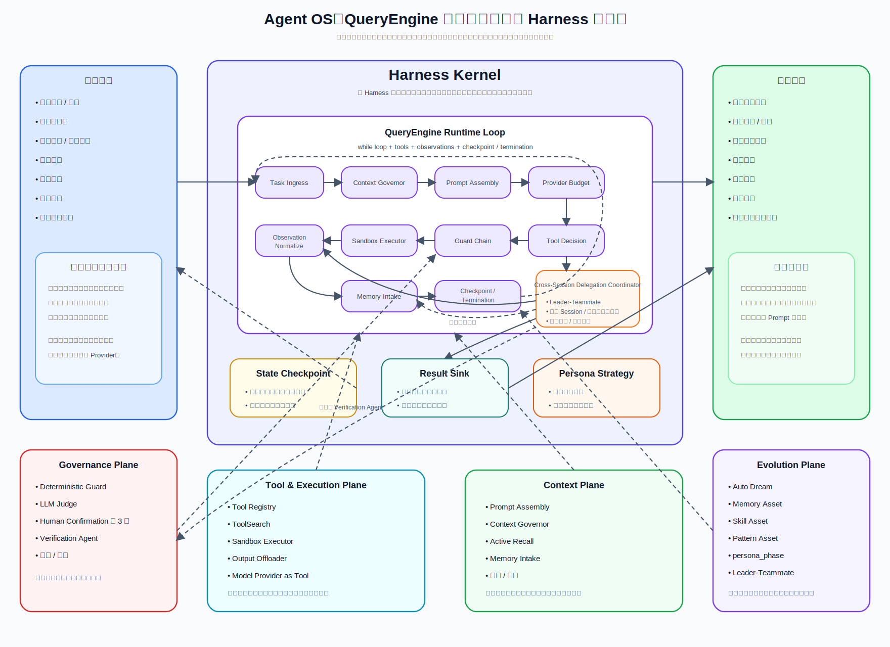

# Agent OS 子模块 Architecture Design

## 1. 文档说明

本文档是 `Agent OS` 子模块的第一份正式 `Architecture Design`。
它用于收口 `Agent OS` 在平台中的定位、边界、核心组件、运行时主链路与
后续下游文档边界。

### 1.1 输入

- 上游需求基线：[`Requirement Spec`](../../../specifications/cmp-phase1-requirement-spec.md)
- 总平台架构：[`Architecture Design`](../../architecture-design.md)
- 总平台接口边界：[`API Design`](../../api-design.md)
- 总平台共享内部边界：[`Detailed Design`](../../detailed-design.md)
- 总平台实施骨架：[`Implementation Plan`](../../implementation-plan.md)

### 1.2 输出

- 本文：[`Architecture Design`](./architecture-design.md)
- 配套架构图：[`agent-os-architecture.svg`](./agent-os-architecture.svg)
- 为后续该子模块 `API Design`、`Detailed Design`、`Implementation Plan`
  预留明确下沉边界

### 1.3 阅读边界

本文只回答“`Agent OS` 在平台中如何成立、如何承接 AI 运行时能力、如何与
业务模块及环境输入协作”。
不展开以下内容：

- 不写接口路径、字段明细、错误码、回调协议
- 不写内部表结构、索引、缓存键、队列主题或 Provider SDK 封装细节
- 不写 Prompt 模板变量明细、工具参数协议、Memory 存储物理模型
- 不写实施排期、里程碑、工时、负责人拆分

## 2. 架构图



该图显式包含 `Cross-Session Delegation Coordinator`，并把它作为 `QueryEngine Runtime Loop` 主链路中的委派协调构件，而不是隐藏在 `Evolution Plane` 的 `Leader-Teammate` 语义里。`Tool Decision` 可将合同风险分析分派、审批异常调查、签署失败排查、履约逾期预警等任务交给独立 Session；委派输入只携带最小必要上下文，结果以摘要和证据回收到 `Observation Normalize` / `Result Sink`，团队记忆同步回主链路，冲突或不一致结果转 `Verification Agent`。

## 3. 子模块定位与设计目标

`Agent OS` 是围绕 `QueryEngine` 的薄 Harness 运行时，也是平台 AI 能力底座。
在总平台层，AI 能力不再把 `AI Gateway`、工具路由、Prompt 拼装、记忆与治理
拆成并列架构主语义，而是统一收口到 `Agent OS` 的 `QueryEngine` 主循环。
更细的 AI 内部拆解都必须回挂到这条主循环的输入、上下文、工具、观察、检查点或终止条件。

在合同管理平台这类企业业务系统中，`Agent OS` 面向合同起草 / 审查、审批流辅助、文档比对、签署状态解释、履约风险提示、风控预警和运维审计回放等任务，而不是面向开发者编码场景的运行时产品。

`Agent OS` 统一承接以下能力，但这些能力不是并列堆叠，而是服务于薄 Harness 的运行时闭环：

- `general agent persona`
- `specialized agent persona`
- 提示词装配
- 工具调用
- 模型 / Provider 选择
- runtime loop
- memory
- audit
- human-in-the-loop / 人机确认

本子模块的设计目标如下：

- 让平台 AI 能力以 `Agent OS` 为唯一运行时底座，而不是散落在业务模块内
- 让 Agent 的人格、提示词、工具、模型、记忆、审计都围绕 `QueryEngine` 形成统一治理链路
- 让模型成为 `QueryEngine` 每轮决策中的一类工具能力，而不是整个运行时中心
- 采用“薄 Harness + 强模型”的架构取舍：`Agent OS` 负责确定性边界、上下文治理、工具治理、安全隔离、审计和恢复，不把业务推理流程堆成复杂 `DAG`，也不以过厚工作流替代模型推理能力
- 让 AI 能力保持对单一模型、单一 Provider 的解耦
- 让业务输入与环境输入都能进入统一的运行时感知与处理主链路
- 让多 Agent 协作采用跨 Session 委派，而不是在同一超长上下文里频繁切换人格
- 让静态底座提示词与动态注入形成稳定分层，且静态底座输出约束适用于全部 Agent

## 4. 在总平台中的边界

### 4.1 `Agent OS` 拥有的内容

- Agent 运行时主循环与执行上下文编排
- 通用人格与专用人格的承载与装配规则
- 静态底座提示词、动态注入提示词与上下文拼装
- 工具路由、模型 / Provider 选择、检索与规则挂接
- 记忆体系、审计链路、人工确认关口与结果回写编排
- `Auto Dream daemon` 与 `skeptical memory` 等内部能力域
- 多 Agent 跨 Session 委派的运行时协调能力

### 4.2 `Agent OS` 不拥有的内容

- 不拥有业务模块自己的领域真相与业务状态主档
- 不拥有文件系统、数据库、规则引擎、外部系统本体，只消费其输入与工具能力
- 不把某个模型 SDK、某个 Provider 网关实现当作平台 AI 主语义
- 不在本层定义具体 API、具体存储结构或具体排期

### 4.3 与总平台的关系判断

- 业务模块把 AI 相关处理诉求提交给 `Agent OS`，而不是直接耦合具体模型
- 环境中的错误、回调、告警、文件读取失败、数据库查询失败等也可作为
  `Agent OS` 的正式输入
- `Agent OS` 对外表现为平台 AI 运行时底座，对内再展开人格、提示词、工具、
  记忆、审计与委派等能力域

## 5. 关键组件划分

`Agent OS` 在架构层按薄 Harness 分层，而不是按能力清单平铺。所有组件都必须能说明自己接入 `QueryEngine` 的哪个环节。

### 5.1 `Harness Kernel`

`Harness Kernel` 是 `Agent OS` 的运行时内核，负责维护最小可执行闭环：

- `Input Ingress`：统一接收业务模块输入与环境输入，并转化为 `QueryEngine` 可消费任务。
- `QueryEngine`：以 `while loop` 推进任务，按“上下文装配 -> 模型或规则决策 -> 工具动作 -> 观察归一 -> 检查点 -> 终止检查”工作。
- `Persona Layer`：装配 `general agent persona` 与 `specialized agent persona`，但人格只能影响运行策略，不能替代内核主循环。
- `State Checkpoint`：记录每轮上下文摘要、动作、观察、风险、成本和终止判断。
- `Cross-Session Delegation Coordinator`：从 `Tool Decision` 或观察阶段接入跨 Session 委派，向独立 Session 发送最小必要上下文，并把结果摘要、证据回收、团队记忆同步和冲突转验证统一接回主链路。
- `Result Sink`：把终态结果转成业务模块可消费对象，而不是外泄内部 Prompt 或 Provider 原始响应。

### 5.2 `Tool & Execution Plane`

`Tool & Execution Plane` 是模型与现实世界交互的确定性边界：

- `Tool Registry / ToolSearch`：管理工具元数据、按需发现完整 schema、工具定义快照和工具授权。
- `Tool Router`：把检索、规则、文件、数据库、外部 API、模型 / Provider 等能力作为统一工具集调度。
- `Model Provider Abstraction`：把模型能力作为工具能力接入，负责能力分类、Provider 选择、降级、成本和配额观察。
- `Sandbox Executor`：对工具调用做权限分级、超时隔离、副作用约束和结果卸载。
- `Observation Normalizer`：把工具成功、失败、超时、拒绝、人工确认结果统一转成 `QueryEngine` 下一轮可消费观察。

### 5.3 `Context Plane`

`Context Plane` 管理模型每轮真正能看到的内容：

- `Prompt Assembly`：负责静态底座提示词与动态注入内容的拼装、裁剪、排序与快照。
- `Context Governor`：负责微压缩、事实压缩、完整压缩、自动熔断、工具调用 / 结果成对保留和压缩前记忆冲洗。
- `Skeptical Memory`：负责短期上下文、长期记忆、怀疑式校验、主动召回与记忆可信度分层。
- `Output Offloader`：把超长工具结果、长文档和 Provider 原始响应转为摘要 + 引用，避免污染主 Prompt。

### 5.4 `Governance Plane`

`Governance Plane` 保留企业级确定性治理能力，保证薄 Harness 不是无约束自动化：

- `Guard Chain`：承接确定性规则、LLM Judge、人工确认和运行时沙箱的安全硬链路。
- `Human Confirmation Gate`：负责高风险动作、关键决策、越权操作与人工确认链路。
- `Audit & Observability`：负责执行留痕、决策摘要、工具调用摘要、异常记录、指标、成本和可追溯审计。
- `Verification Runtime`：让独立验证角色消费证据包、业务对象变更差异、合同 / 文档版本差异、流程状态、对象状态和运行输出，避免实现者自证。
- `Quota & Policy`：管理成本配额、速率限制、Provider 熔断、权限边界和运行策略版本。

### 5.5 `Evolution Plane`

`Evolution Plane` 负责把运行经验沉淀成可治理资产，但不直接干预当前轮决策：

- `Auto Dream Daemon`：异步反思、候选经验沉淀、后台整理与可复用模式提炼。
- `Memory / Skill / Pattern Asset Pipeline`：把候选沉淀转成记忆、技能或模式资产，并经过验证、灰度、发布和回滚。
- `Team Memory Sync`：接收跨 Session 委派回收后的可沉淀经验，只在验证、灰度和发布后进入团队级记忆或模式资产。
- `Drill & Operations`：维护故障演练、恢复流程、回归基线和运维手册。

这些分层只定义职责区，不在本层写死类图、存储表、消息协议或 SDK 细节。

## 6. 通用 Agent 人格与专用 Agent 人格的关系

`general agent persona` 是平台默认 AI 行为底座，负责所有 Agent 共享的
基础行为约束、输出约束与安全边界。

`specialized agent persona` 建立在通用人格之上，用于承接特定任务域、
工具集、流程规约与专业判断模式。

两者关系原则如下：

- 通用人格提供统一行为底板，不因任务切换而丢失
- 专用人格不是替换整个平台底座，而是在通用人格之上追加领域能力
- 输出约束、安全约束、审计要求等静态底座规则适用于全部 Agent
- 同一任务链路中如需切换到其他专用 Agent，应通过跨 Session 委派完成，
  而不是在一个长上下文中反复重写人格

## 7. 静态底座提示词工程与动态注入的关系

`Agent OS` 的提示词工程采用“静态底座 + 动态注入”。

### 7.1 静态底座

- 承载全部 Agent 共享的身份边界、输出约束、安全规则、协作准则
- 是平台级稳定底板，不随单次任务而频繁变化
- 其中的输出约束适用于全部 Agent

### 7.2 动态注入

- 承载任务目标、业务上下文、环境事件、工具可用性、用户追问、最近记忆摘要
- 按当前任务、当前 Session、当前角色动态装配
- 允许不同专用 Agent 在同一静态底座之上形成差异化运行表现

### 7.3 两者的关系原则

- 静态底座负责稳定约束，动态注入负责当前任务适配
- 动态注入不能绕过静态底座的公共安全与输出约束
- 提示词装配优先考虑裁剪与拼装，而不是在超长上下文中无边界堆叠

## 8. 多 Agent 跨 Session 委派的架构定位

多 Agent 协作不是在同一超长上下文里频繁切换人格，而是通过
`Cross-Session Delegation Coordinator` 发起跨 Session 委派。

其架构定位如下：

- 主 Agent 保持当前任务主线与平台级真相
- 被委派 Agent 在独立 Session 中承接某类专门任务
- 委派输入以任务目标、约束、必要上下文摘要为主，而不是复制整段长上下文
- 委派输出以结果摘要、证据、建议或结构化回执回收至主链路
- 委派关系纳入审计，避免人格漂移、上下文污染与责任边界不清

## 9. `Agent OS` 与业务模块 / 环境输入 / 工具系统的关系

### 9.1 与业务模块的关系

- 合同、流程、文档、搜索、门户等业务模块都可以向 `Agent OS`
  提交 AI 任务诉求
- 业务模块提供业务上下文与目标，不直接绑定模型或 Provider
- `Agent OS` 输出决策建议、生成结果、操作建议或工具执行结果，
  再回写业务模块

### 9.2 与环境输入的关系

以下内容都属于 `Agent OS` 可接收的正式输入，而不只是“异常日志附件”：

- 文件读取错误
- 数据库查询错误
- 外部回调异常
- 用户追问
- 运行时观测事件
- 工具执行失败或超时

这些环境输入进入 `Input Ingress` 后，会成为运行时感知阶段的一部分。

### 9.3 与工具系统的关系

- 模型 / Provider 是工具系统中的一类能力，而不是整个运行时中心
- 检索、规则、文件、数据库、外部 API 与模型一样，都通过统一工具路由接入
- `Agent OS` 负责选择何时调用哪类工具，以及如何整合观察结果
- 工具结果进入 `Observe` 环节，驱动后续步骤、记忆沉淀、确认或回写

## 10. `QueryEngine` 主链路

### 10.1 输入进入

1. 业务模块输入或环境输入进入 `Input Ingress`。
2. 系统识别任务类型、风险等级、可用上下文与候选人格。
3. `Persona Layer` 选择通用人格底板，并决定是否叠加专用人格。
4. `Context Governor` 评估上下文预算、记忆召回、工具结果保留策略和必要压缩。
5. `Prompt Assembly` 组装静态底座与动态注入，形成本轮 Prompt 快照。

### 10.2 `while loop + tools + observations + termination checks`

`QueryEngine` 的核心是薄 Harness 循环，而不是预编排的复杂业务 `DAG`：

```text
while run not terminal:
  assemble prompt and governed context
  check provider budget and policy
  call model or deterministic rule for next decision
  decide tool / confirmation / delegation / final answer
  pass decision through guard chain
  execute allowed tool in sandbox
  normalize observations
  flush valuable facts to memory intake
  write state checkpoint and audit event
  check termination conditions
```

每轮循环的固定语义如下：

1. `Prompt Assembly` 只装入本轮所需的高信噪比上下文，不拼接完整历史。
2. `Provider Budget Check` 在模型调用前判断成本、速率、熔断和降级路径。
3. `Tool Decision` 允许选择检索、规则、文件、数据库、外部 API、模型、人工确认或委派。
4. `Guard Chain` 在动作执行前强制安全拦截，不能只依赖 Prompt 自律。
5. `Sandbox Executor` 执行被授权工具，并把长结果卸载为摘要 + 引用。
6. `Observation Normalizer` 把工具结果、失败、拒绝、确认和委派回收统一转成观察。
7. `State Checkpoint` 记录本轮动作、观察、风险、成本、记忆冲洗和下一步候选。
8. `Termination Check` 固定检查外部取消、人工驳回、最大循环、最大成本、风险不可接受和结果满足契约。

### 10.3 记忆、反思与确认

1. `Skeptical Memory` 对候选记忆进行可信度校验，不把所有结果直接沉淀为事实。
2. `Context Governor` 在压缩前触发记忆冲洗，避免关键事实随上下文裁剪丢失。
3. `Auto Dream Daemon` 在后台异步整理模式、失败教训与可复用经验。
4. 涉及高风险操作、关键业务判断或越权动作时，进入
   `Human Confirmation Gate`。

### 10.4 审计与结果回写

1. `Audit & Result Sink` 记录输入、关键决策、工具调用、异常与确认结果。
2. 最终结果回写到对应业务模块、环境事件处理链或委派回收链路。
3. 如任务需要进一步拆分，则由 `Cross-Session Delegation Coordinator`
   发起新的跨 Session 委派。

## 11. 安全与扩展考虑

### 11.1 安全考虑

- 静态底座必须统一约束全部 Agent 的输出、安全、权限与审计规则
- 高风险动作必须经过 `Human Confirmation Gate`，不能由 Agent 静默越权执行
- 工具调用必须区分只读、受控写入、高风险副作用等不同等级
- 记忆沉淀必须保留怀疑式校验，避免错误观察被长期固化
- 跨 Session 委派必须控制最小必要上下文，避免无边界扩散敏感信息
- 模型与 Provider 可替换，但替换不能破坏审计与安全约束闭环

### 11.2 扩展考虑

- 后续可新增更多专用 Agent persona，而不改写通用人格底座
- 后续可新增更多模型、Provider 或检索策略，而不改变 `Agent OS`
  作为统一运行时底座的定位
- 后续可新增更多环境输入源，只要先进入 `Input Ingress`
- 后续可新增更多后台反思、记忆整理与策略优化能力，但仍应挂在
  `Agent OS` 内部能力域

## 12. 下沉到该模块 `API Design` / `Detailed Design` / `Implementation Plan` 的内容边界

### 12.1 下沉到后续 `API Design` 的内容

- Agent 任务提交、查询、取消、回收等接口资源边界
- 外部业务 API、内部控制面 API、运维审计 API 的平面边界与泄露限制
- 任务、运行、结果、确认、委派、环境输入、审计视图等对外契约
- 多 Agent 委派发起、回收与结果交换接口边界

### 12.2 下沉到后续 `Detailed Design` 的内容

- Persona 继承关系、提示词装配内部模型、工具路由策略
- `QueryEngine Runtime Loop` 状态机、每轮步骤对象、记忆分层模型、审计事件模型
- `Auto Dream daemon` 与 `skeptical memory` 的内部协作机制
- Human gate 判定规则、Provider 适配器、异常补偿与回写细节

### 12.3 下沉到后续 `Implementation Plan` 的内容

- 分阶段建设顺序与迭代范围
- 各组件实现任务拆分、联调顺序、验证顺序
- 风险、依赖、排期与交付组织方式

### 12.4 专项设计挂接关系

父文档只保留架构主语义，以下细则由专项设计承接并回挂到 `QueryEngine` 主循环：

- Prompt / Context：由 [`prompt-layering-and-versioning-design.md`](./special-designs/prompt-layering-and-versioning-design.md) 承接 `Prompt Assembly`、静态底座、动态注入、缓存友好排序；由 [`memory-retrieval-and-expiration-design.md`](./special-designs/memory-retrieval-and-expiration-design.md) 承接记忆召回、压缩前记忆冲洗和失效治理。
- Tool / Sandbox：由 [`tool-contract-and-sandbox-design.md`](./special-designs/tool-contract-and-sandbox-design.md) 承接 `Tool Registry`、`ToolSearch`、`Sandbox Executor` 和 `Output Offloader`。
- Provider Budget：由 [`provider-routing-and-quota-design.md`](./special-designs/provider-routing-and-quota-design.md) 承接 `QueryEngine Round Budget`、配额、速率、熔断和降级。
- Human Gate：由 [`human-confirmation-and-console-design.md`](./special-designs/human-confirmation-and-console-design.md) 承接人工确认、安全硬链路第 3 层与暂停 / 恢复语义。
- Verification Runtime：由 [`verification-and-performance-design.md`](./special-designs/verification-and-performance-design.md) 承接 `Verification Agent`、验证报告和性能基线。
- Evolution Plane：由 [`auto-dream-daemon-candidate-quality-design.md`](./special-designs/auto-dream-daemon-candidate-quality-design.md) 承接 `Memory Asset`、`Skill Asset`、`Pattern Asset` 的候选质量、灰度、发布和回滚。
- Persona Phase：由 [`specialized-agent-persona-catalog-design.md`](./special-designs/specialized-agent-persona-catalog-design.md) 承接职责阶段轴、领域能力轴和人格边界。
- Delegation：由 [`delegation-scheduler-design.md`](./special-designs/delegation-scheduler-design.md) 承接 `Leader-Teammate`、跨 Session 隔离、团队记忆同步和冲突回收。
- Drill/Ops：由 [`drill-and-operations-runbook-design.md`](./special-designs/drill-and-operations-runbook-design.md) 承接演练场景、恢复手册、指标复盘和运维审计闭环。

### 12.5 不应继续留在本架构文档中的内容

- 具体接口字段、消息体与错误码
- 具体表结构、索引、缓存、队列主题与部署参数
- 具体 Prompt 变量明细与模型参数调优细节
- 具体实施排期、工时与负责人安排

## 13. 本文结论

`Agent OS` 是平台 AI 能力的统一底座与围绕 `QueryEngine` 的薄 Harness 运行时。
它在总平台层吸收 AI 的整体主语义，在子模块内部把人格、提示词、工具、记忆、审计、人工确认与跨 Session 委派等能力域统一回挂到主循环。

这样的平台结构确保：

- AI 能力不绑定单一模型或单一 Provider
- 模型只是 `QueryEngine` 决策和工具体系中的一类能力，而不是平台 AI 中心
- 业务输入与环境输入都能进入统一运行时主链路
- 多 Agent 协作建立在跨 Session 委派之上，而不是人格混杂的长上下文切换
- 企业审计、人工确认、安全沙箱、成本配额和验证制度作为治理平面保留，不被薄 Harness 取舍削弱
