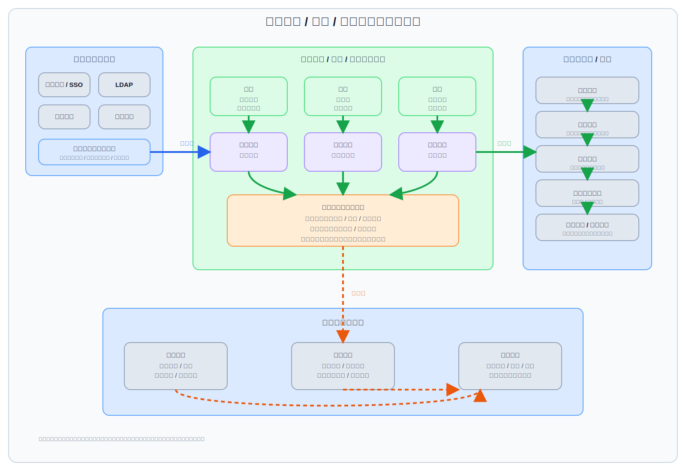

# 组织架构 / 权限 / 统一认证主线 Architecture Design

## 1. 文档说明

本文档是组织架构 / 权限 / 统一认证主线的第一份正式
`Architecture Design`。
它用于在合同管理平台总平台约束下，统一收口组织架构、身份认证、角色权限、
数据权限，以及 `SSO` / `LDAP` / 企业微信身份映射的共同边界、共享模型与对
其他模块的支撑关系。

### 1.1 输入

- 上游需求基线：[`Requirement Spec`](../../../specifications/cmp-phase1-requirement-spec.md)
- 总平台架构：[`Architecture Design`](../../architecture-design.md)
- 总平台接口边界：[`API Design`](../../api-design.md)
- 总平台共享内部边界：[`Detailed Design`](../../detailed-design.md)
- 总平台实施骨架：[`Implementation Plan`](../../implementation-plan.md)
- 流程引擎架构：[`Architecture Design`](../../modules/workflow-engine/architecture-design.md)
- 文档中心架构：[`Architecture Design`](../../modules/document-center/architecture-design.md)
- 加密文档架构：[`Architecture Design`](../../modules/encrypted-document/architecture-design.md)
- 外围系统集成架构：[`Architecture Design`](../integration-hub/architecture-design.md)

### 1.2 输出

- 本文：[`Architecture Design`](./architecture-design.md)
- 配套架构图：[`identity-access-architecture.svg`](./identity-access-architecture.svg)
- 组织架构 / 权限 / 统一认证主线的正式定位、边界与协作关系说明
- 为后续该主线 `API Design`、`Detailed Design`、`Implementation Plan`
  预留明确下沉边界

### 1.3 阅读边界

本文只回答“身份与组织权限主线如何在平台中成立、如何划边界、如何支撑其他
模块”。不展开以下内容：

- 不写登录接口、鉴权接口、回调地址、字段明细、错误码
- 不写组织表、权限表、关系表、索引、缓存键与同步任务参数
- 不写审批规则表达式、菜单树协议、前端路由守卫或页面交互细节
- 不写实施排期、联调顺序、负责人拆分与工时估算

## 2. 架构图

## 3. 主线定位与设计目标

组织架构 / 权限 / 统一认证主线是合同管理平台的底座级组合主线。
它不是单一登录模块，也不是把组织架构、权限、`SSO`、`LDAP`、企业微信各写成
彼此孤立的几套子系统，而是统一持有平台的身份、组织、角色、授权边界与身份映射
规则，为流程、合同、文档、通知、审计、集成等模块提供同一份可复用的身份治理底座。

本主线的设计目标如下：

- 让平台只存在一套正式的用户、组织、角色、权限真相，避免业务模块各自维护
- 让审批节点始终绑定部门、人员或组织规则，不允许脱离组织主数据运行
- 让多组织管理成为正式一等能力，而不是单租户组织树上附带的兼容选项
- 统一收口菜单权限、功能权限、数据权限，避免前后台各自解释授权语义
- 统一收口 `SSO`、`LDAP`、企业微信带来的身份映射差异，保证同一自然人在平台内
  形成稳定主体身份
- 为管理端按部门、人员授予解密下载授权提供稳定的组织与授权边界
- 让身份流、授权流、审计流形成闭环，并能被其他主线稳定复用

## 4. 在总平台中的边界

### 4.1 主线拥有的内容

- 平台统一用户主体、账号关系与身份映射规则
- 平台统一组织模型，包括多组织、部门、岗位归属、成员挂接关系
- 角色、菜单权限、功能权限、数据权限的统一授权语义
- 统一认证入口、会话建立、登录结果承接与外部身份归一责任
- 面向其他模块的组织解析、权限判定、授权查询与身份上下文供给责任

### 4.2 主线不拥有的内容

- 不拥有合同主档，不维护合同一级业务真相
- 不拥有文档中心中的文件对象与版本链真相
- 不拥有流程定义、流程实例与审批结果真相
- 不拥有通知消息、审计记录、外部系统业务数据的一级真相
- 不允许业务模块绕开本主线自建用户、组织、角色、权限主数据真相

### 4.3 与总平台的关系判断

- 本主线是平台底座级组合主线，不是某个管理后台页面能力
- 业务模块可扩展本领域规则，但不能改写平台统一身份与组织真相
- 合同、流程、文档、加密、通知、集成等模块都应消费本主线提供的统一身份、
  组织与授权边界
- 外部认证系统影响“身份如何进入平台”，不改变“平台内身份真相归谁治理”

## 5. 能力分组

### 5.1 组织架构

组织架构能力回答“平台中的人属于哪个组织、哪个部门、在什么规则下可被选中”。

- 支持多组织管理，并在组织之下承载部门、岗位、成员归属与管理关系
- 组织模型是流程节点绑定、数据权限裁剪、管理授权落点的共同基础
- 审批节点必须直接绑定部门、人员或组织规则，组织规则的解释来源也必须回到
  本主线的组织模型
- 组织变更会影响审批选人、授权命中与可见范围，但业务模块不应复制一份组织树
- 组织架构提供的是组织真相与解析能力，不直接拥有审批实例或业务状态

### 5.2 身份认证

身份认证能力回答“用户如何被确认是平台中的谁，并获得可用会话”。

- 统一承接平台登录入口、认证结果、会话建立与主体激活
- 统一处理本地账号与外部认证主体之间的承接关系
- 登录成功后产出的不是业务模块私有账号，而是平台统一身份上下文
- 认证结果需要为后续菜单权限、功能权限、数据权限判断提供稳定输入
- 认证链路失败、冲突或映射异常应进入审计与告警闭环，而不是只停留在登录日志

### 5.3 角色 / 权限

角色 / 权限能力回答“谁可以进入哪里、执行什么动作”。

- 角色是授权聚合载体，但不应替代部门、人员与数据范围边界
- 菜单权限负责界面入口可见性与导航边界
- 功能权限负责按钮、动作、管理能力和模块内操作边界
- 角色授权应建立在统一身份和组织上下文之上，不由业务模块单独解释
- 权限判断结果既服务前台交互，也服务后台接口、异步任务与管理端操作校验

### 5.4 数据权限

数据权限能力回答“同样拥有功能入口的人，能看到和处理哪些数据范围”。

- 数据权限是正式一等能力，不应退化为列表页附带过滤条件
- 数据权限边界应围绕组织、部门、人员、角色和业务归属等统一语义成立
- 合同列表、审批待办、文档可见范围、授权管理范围等都应复用同一数据权限解释
- 管理端按部门、人员授予解密下载授权时，也必须受数据权限与业务上下文约束
- 数据权限不拥有业务数据真相，只对业务模块已有真相做受控裁剪与判定

### 5.5 统一认证 / SSO / LDAP / 企业微信映射

这一组能力回答“外部身份如何进入平台，并稳定映射为平台统一主体”。

- `SSO`、`LDAP`、企业微信都会影响身份映射，因此必须统一收口到同一映射治理边界
- 平台需要区分外部身份标识与平台内部主体标识，避免把外部账号直接当作内部真相
- 同一自然人来自多个认证源时，应归并到同一平台身份，而不是在各模块形成多份账号
- 身份映射应服务登录、组织挂接、角色授权、审批选人与审计归因
- 外部身份源是输入来源，不是平台内组织、权限、审计归因的最终真相源

## 6. 与流程引擎的关系

组织权限主线与流程引擎的关系是“为审批运行提供身份、组织与授权底座”，
而不是“替代流程引擎持有流程真相”。

- 流程引擎不应自建一套用户、部门、角色真相
- 每个审批节点必须绑定部门、人员或组织规则，绑定来源统一来自本主线
- 组织规则解析结果由本主线提供，流程引擎消费解析结果并驱动实例运行
- 审批人是否可见待办、是否可执行转办、是否可查看流程相关合同与文档，需同时受
  功能权限与数据权限约束
- 审批动作产生的责任主体应引用平台统一身份，以保证审计归因一致

## 7. 与合同主档、文档中心、加密下载授权的关系

### 7.1 与合同主档的关系

- 本主线不拥有合同主档，只提供合同主档所依赖的身份、组织与授权边界
- 合同创建人、归属部门、经办人、审批参与人等身份字段应引用平台统一主体
- 合同可见范围、可操作范围、管理范围应复用统一数据权限解释，而不是合同模块
  私自维护一套权限口径

### 7.2 与文档中心的关系

- 文档中心不应自建一套文档访问用户体系
- 文档预览、下载、协作、批注与版本切换等动作，都应建立在本主线给出的统一身份
  与授权判断之上
- 文档中心持有文件真相，本主线持有“谁在什么范围内可以访问这些文件”的边界

### 7.3 与加密下载授权的关系

- 管理端可按部门、人员做解密下载授权，这是本主线与加密文档主线的重要协作边界
- 该授权不是纯文件能力开关，而是建立在统一组织、人员、角色与数据权限之上的
  受控授权语义
- 本主线负责解释“谁因何被授权、授权是否命中、授权边界落在哪个部门或人员”
- 加密文档主线负责执行受控解密下载与结果留痕，但不应自己维护一套组织授权主数据

## 8. 与通知、审计、集成主线的关系

### 8.1 与通知的关系

- 通知中心消费本主线提供的统一身份、组织归属和触达对象解析结果
- 谁该收到待办、告警、授权结果、身份异常通知，应由本主线提供稳定主体基础
- 通知中心负责通道分发，不改写组织权限真相

### 8.2 与审计的关系

- 登录成功、登录失败、映射冲突、授权变更、角色变更、数据权限命中、组织变更等
  都属于关键审计事件
- 审计归因必须引用平台统一身份，避免同一人在不同认证源下形成碎片化留痕
- 本主线定义关键身份与授权事实，审计主线负责统一留痕、检索与追溯

### 8.3 与集成主线的关系

- 集成主线承接外部身份源、目录源和移动入口，本主线承接其进入平台后的身份归一
- `SSO`、`LDAP`、企业微信的对接协议差异由集成主线或统一适配层隔离
- 映射结果一旦进入平台，组织、角色、权限、数据范围的正式解释权归本主线
- 外部身份同步、变更回传、禁用或组织变更都应形成统一身份流与审计流，不应散落在
  各业务模块私接逻辑中

## 9. 主链路

本主线在架构层可归纳为三条主链路。

### 9.1 身份流

1. 用户从平台登录入口、`SSO`、`LDAP` 或企业微信进入合同管理平台。
2. 平台承接认证结果并识别外部身份来源。
3. 身份映射能力将外部身份归并为平台统一主体。
4. 平台加载该主体对应的多组织归属、部门关系、角色与可用状态。
5. 系统建立统一身份上下文，供合同、流程、文档、通知等模块复用。
6. 关键认证结果、映射冲突与异常进入审计链路。

### 9.2 授权流

1. 用户携带统一身份上下文访问菜单、功能、数据或管理端授权能力。
2. 平台基于角色、菜单权限、功能权限和数据权限进行统一判定。
3. 若命中流程、合同、文档或解密下载场景，再结合组织归属、部门 / 人员授权与
   业务上下文收口最终结果。
4. 业务模块只消费授权结果与身份边界，不单独生成第二套权限真相。
5. 授权命中、拒绝、越权尝试和高敏动作进入审计与告警闭环。

### 9.3 审计流

1. 登录、映射、组织变更、角色授权、数据权限命中、解密下载授权命中等事件产生。
2. 事件统一引用平台主体、组织上下文、目标对象与动作结果。
3. 审计主线记录并支持追溯身份来源、授权依据与责任主体。
4. 通知与运营能力可基于审计事实触发异常告警、整改或人工复核。

## 10. 安全与扩展考虑

### 10.1 安全考虑

- 平台内必须只有一套正式身份与组织真相，禁止业务模块旁路复制
- 外部身份映射冲突、主体合并错误、组织挂接异常必须可发现、可审计、可处理
- 菜单权限、功能权限、数据权限必须协同判断，避免只校验其一形成越权
- 高敏动作如角色变更、数据范围扩大、解密下载授权必须纳入高等级审计
- 多组织场景下必须避免跨组织错误继承权限、错误继承数据范围

### 10.2 扩展考虑

- 后续增加新的认证源时，应继续复用统一身份映射边界，而不是为新来源新建账号体系
- 后续增加新的业务模块时，应只消费统一身份、组织与权限能力，不再复制底座逻辑
- 后续增加更复杂的组织规则或数据权限规则时，应保持共享模型稳定，不让业务模块
  感知底层来源差异
- 后续若扩展更多移动入口、门户或外部目录，也应先进入统一认证与身份映射收口点

## 11. 下沉到后续 API / Detailed / Plan 的内容边界

下列内容应继续下沉到后续文档，而不在本文展开：

### 11.1 下沉到 `API Design` 的内容

- 登录、登出、会话续期、统一认证回调、身份映射查询等接口边界
- 组织、角色、菜单权限、功能权限、数据权限、授权管理等资源接口边界
- 管理端解密下载授权配置与查询对象的接口契约

### 11.2 下沉到 `Detailed Design` 的内容

- 用户、组织、部门、角色、权限、映射关系的内部模型与约束
- 认证承接、身份归并、组织解析、数据权限求值、授权缓存与审计事件组织方式
- 多组织隔离、主体合并冲突处理、权限继承与撤销的内部实现

### 11.3 下沉到 `Implementation Plan` 的内容

- 建设阶段划分、目录同步联调、统一认证联调、权限治理上线顺序
- 与流程引擎、文档中心、加密文档、通知、审计、集成主线的联动落地安排
- 验证、回归、迁移与灰度切换的任务拆分

### 11.4 不应继续留在本架构文档中的内容

- 接口路径、字段、错误码、签名协议与回调参数
- 表结构、索引、缓存、队列、同步任务和脚本设计
- 页面原型、权限树交互、审批规则表达式与实施排期

## 12. 本文结论

组织架构 / 权限 / 统一认证主线是合同管理平台的统一身份与授权底座。
它不拥有合同、文件、流程等业务真相，但它为这些主线提供稳定一致的身份、组织、
角色、权限与身份映射边界，保证平台内不再出现各模块各养一套用户、组织、权限
真相的分裂结构。
