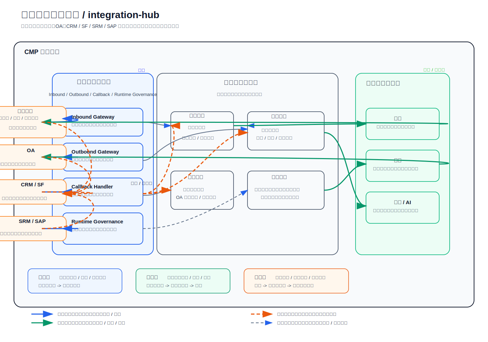

# 外围系统集成主线 Architecture Design

## 1. 文档说明

本文档是 `CMP` 外围系统集成主线的第一份正式 `Architecture Design`。
它用于在总平台架构约束下，统一收口企业微信、`OA`、`CRM`、`SF`、`SRM`、
`SAP` 等外围系统在平台中的共同边界、集成模式、适配责任、回调责任与
运行治理责任。

### 1.1 输入

- 上游需求基线：[`Requirement Spec`](../../../specifications/cmp-phase1-requirement-spec.md)
- 总平台架构：[`Architecture Design`](../../architecture-design.md)
- 合同管理本体架构：[`Architecture Design`](../../modules/contract-core/architecture-design.md)
- 文档中心架构：[`Architecture Design`](../../modules/document-center/architecture-design.md)
- 流程引擎架构：[`Architecture Design`](../../modules/workflow-engine/architecture-design.md)

### 1.2 输出

- 本文：[`Architecture Design`](./architecture-design.md)
- 配套架构图：[`integration-hub-architecture.svg`](./integration-hub-architecture.svg)
- 为后续该主线 `API Design`、`Detailed Design`、`Implementation Plan`
  预留明确下沉边界

### 1.3 阅读边界

本文只回答“外围系统集成主线如何在平台中成立、如何划边界、如何治理”。
不展开以下内容：

- 不写接口路径、字段明细、签名算法细节、错误码与回调报文
- 不写单个外部系统的表结构映射、任务重试参数、消息主题或脚本细节
- 不写 `OA`、企业微信、`CRM`、`SF`、`SRM`、`SAP` 各自的实施排期与联调计划
- 不写平台内某个适配器的类划分、配置键命名或部署脚本细节

## 2. 架构图

## 3. 主线定位与设计目标

外围系统集成主线不是把每个外部系统拆成一套独立平台，也不是把外部系统本体
改造责任写进 `CMP`。它的角色是为 `CMP` 提供统一外部接入边界，让平台能够在
合同主档、文档中心、流程引擎三类核心真相源不被冲散的前提下，稳定承接外围
 系统输入、向外围系统输出业务事实，并对回调、补偿、审计、通知与运行状态进行
统一治理。

本主线的设计目标如下：

- 统一收口外围系统的接入边界，避免每个业务模块各自直连外部系统
- 保持合同主档是业务真相源、文档中心是文件真相源、流程引擎是运行时真相源
- 让 `OA` 作为默认主审批外部路径成立，同时不削弱平台对审批承接与结果治理的责任
- 让 `CRM`、`SF`、`SRM`、`SAP` 主要承接主数据、业务单据或合同的入站 / 出站协作
- 让企业微信作为统一移动入口、消息触达与轻量交互通道，且明确联调依赖测试账号
- 把入站、出站、回调、同步 / 异步、错误处理与运行治理纳入统一适配层约束

## 4. 在总平台中的边界

### 4.1 主线拥有的内容

- 外围系统统一接入边界与协议适配责任
- 外围系统请求鉴权、来源识别、回调校验与幂等治理责任
- 入站 / 出站 / 回调链路的运行编排与状态观测责任
- 外部事实与平台核心对象之间的映射、路由与补偿治理责任
- 面向通知、审计、告警、任务执行的横切协作入口

### 4.2 主线不拥有的内容

- 不拥有合同主档，不维护第二份合同业务真相源
- 不拥有文档中心中的文件对象真相与版本链真相
- 不拥有流程定义、流程实例与审批运行时真相
- 不承担企业微信、`OA`、`CRM`、`SF`、`SRM`、`SAP` 本体改造职责
- 不把外围系统的数据结构直接升级为平台一级领域模型

### 4.3 与总平台的关系判断

- 集成主线是平台底座级组合主线，不是单一业务子模块
- 业务模块不得绕过集成主线直接与外部系统耦合
- 外部系统输出的是“外部事实输入”，平台负责判断如何承接、落库、回写与审计
- 平台向外发出的内容是“受平台治理的业务事实输出”，而不是把内部运行细节原样外泄

## 5. 外围系统能力分组

### 5.1 企业微信

企业微信在本主线中的定位是正式移动承载端之一，承担移动触达、待办处理与业务动作执行能力。
它遵循原生优先、小程序兜底的承载策略，但不是合同业务真相源，也不是流程主状态真相源。

- 轻量场景优先使用企业微信原生能力承接登录、消息通知、待办触达、轻量确认等动作
- 原生能力无法稳定承接的复杂业务，由企业微信内小程序作为正式移动业务承载面，不接受跳回桌面 `CMP Web` 作为正式业务闭环方案
- 企业微信对接需要测试账号，联调准备属于前置条件
- 企业微信回传的是触达结果、轻量动作结果或小程序业务动作结果；合同主状态与流程主状态仍由 `CMP` 平台统一校验、更新与审计
- 企业微信接入中的 SDK 与回调差异由统一适配层隔离，不向合同、文档、流程模块泄漏

### 5.2 `OA`

`OA` 是默认主审批路径的外部系统。
它承接默认审批执行，但不拥有平台合同真相，也不替代平台流程治理责任。

- 平台可将合同审批请求按策略发往 `OA`
- `OA` 回传审批结果、节点进展、异常状态等外部事实
- 平台负责把 `OA` 结果承接为流程摘要、合同状态回写、审计留痕与通知分发
- 当 `OA` 无法满足业务或技术要求时，平台流程引擎正式承接执行路径

### 5.3 `CRM` / `SF` / `SRM` / `SAP`

这一组系统在本主线中主要承接主数据、业务单据或合同的入站 / 出站协作。
它们是外围业务系统，不是 `CMP` 内部模块。

- `CRM` / `SF` 更偏向客户、销售、商机、订单、合同来源信息等业务上下游输入
- `SRM` 更偏向供应商、采购协同、采购单据与供应侧合同协作输入输出
- `SAP` 更偏向财务、主数据、凭证、编码、业务单据与经营主数据交换
- 这组系统的共同边界是“提供外部主数据或业务事实”，而不是接管平台合同主档
- 平台对它们的接入应优先采用统一对象映射、统一幂等、统一错误治理策略

### 5.4 统一适配层

统一适配层是本主线在平台中的正式收口点。
它用于隔离各外围系统协议、认证方式、字段口径、回调格式与错误语义差异。

- 统一适配层对内暴露稳定的平台集成语义
- 统一适配层对外承接各系统的协议差异与字段映射
- 统一适配层负责请求路由、响应归一、回调校验、幂等控制、补偿触发与运行观测
- 统一适配层不定义合同、文档、流程的业务真相，只做边界转换与治理

## 6. 集成模式与责任边界

### 6.1 入站

入站是指外围系统向 `CMP` 输入主数据、业务单据、合同信息、审批结果或触达事件。

- 入站请求先进入统一适配层，再由平台判定落向合同主档、文档中心、流程引擎或其他底座能力
- 入站数据必须先经过来源识别、签名校验、幂等判断、基础格式校验与语义归类
- 入站只代表外部事实进入平台，不代表外部系统自动取得平台真相源地位
- 入站后的正式业务承接由平台内对应真相源负责

### 6.2 出站

出站是指 `CMP` 将受治理的业务事实向外围系统发送。

- 出站内容来自合同主档、文档中心、流程摘要或通知事件的受控投影
- 出站前需完成字段裁剪、脱敏、状态映射与目标系统适配
- 出站不应让外部系统直接感知平台内部私有实现细节
- 出站后的送达结果、失败原因与重试状态仍由平台统一治理

### 6.3 回调

回调是指外围系统对平台已发起动作的结果回传或状态通知。

- 所有回调统一经由集成主线承接，不允许业务模块私接回调入口
- 回调必须校验来源可信、重复请求、顺序冲突与是否已处理
- 回调承接后应回写对应平台真相源或运行摘要，而不是只停留在适配器日志中
- 回调异常、冲突或无法归档的情况必须进入审计与补偿链路

### 6.4 同步 / 异步

同步与异步不是按系统划分，而是按业务语义与运行时风险选择。

- 需要即时确认的鉴权、基础校验、轻量查询可采用同步模式
- 影响状态推进、通知分发、索引刷新、补偿处理、批量对账等场景优先采用异步治理
- 对同一外部系统可同时存在同步请求和异步回调，不应强行统一成单一模式
- 平台必须对同步超时与异步积压分别建立治理策略

### 6.5 错误处理责任

错误处理责任需要在平台与外围系统之间清晰切开。

- 外围系统负责其自身可用性、接口契约正确性与回调来源真实性
- `CMP` 负责接入校验、幂等、路由、状态承接、补偿、审计、告警与人工介入入口
- 当外部系统返回业务拒绝时，平台负责把拒绝结果转译为可被业务理解的状态
- 当平台内部承接失败时，不得把责任含混地写成“等待外部系统修复”
- 平台不得承诺改造外部系统本体来满足 `CMP` 内部设计

## 7. 与合同主档的关系

外围系统集成主线与合同主档的关系是“围绕合同真相源做输入输出治理”，
而不是“让外部系统直接拥有合同真相”。

- 任何外部合同入站、合同状态回写、合同信息出站，都要围绕同一 `contract_id`
  或稳定业务绑定关系收口
- 平台合同主档负责解释“这份合同在业务上是谁、处于什么阶段、当前有效状态是什么”
- 外部系统可提供来源事实、引用信息或结果状态，但不能绕过合同主档成为一级真相源
- 集成主线负责保证外部事实进入平台后可以落到统一合同业务语义上

## 8. 与文档中心的关系

外围系统集成主线与文档中心的关系是“围绕文件真相源承接外部文件输入输出”，
而不是让外部系统自带文件副本直接替代平台文件治理。

- 外部合同附件、扫描件、签章结果稿或归档产物进入平台后，应由文档中心承接文件真相
- 文档出站时，应从文档中心的受控对象与版本视图导出，而不是从业务模块私有附件表导出
- 集成主线负责承接文件类入站 / 出站 / 回调流，但不拥有文件版本链真相
- 文件传输结果、失败原因、回写状态需纳入审计和运行治理

## 9. 与流程引擎的关系

外围系统集成主线与流程引擎的关系是“桥接外部审批事实与平台流程治理”，
而不是把平台流程运行时真相转交给外部系统。

- `OA` 是默认主审批外部路径，但平台流程引擎仍保留正式承接能力
- `OA` 回传的是外部审批事实，平台负责承接为流程摘要、合同状态与时间线事件
- 当平台流程引擎承接审批时，集成主线只承担必要的外部通知、同步或补充回写职责
- 集成主线不定义流程节点、流程路由与实例真相，这些仍由流程引擎治理

## 10. 与通知、审计、搜索、AI 的关系

### 10.1 与通知的关系

- 外围系统入站、出站、回调产生的关键结果和异常应接入通知中心
- 集成主线定义“何时需要通知”，通知中心负责“通过什么通道通知”
- 企业微信可作为通知渠道之一，但不等于通知治理中心

### 10.2 与审计的关系

- 外部请求接入、签名校验、映射结果、状态回写、异常补偿都应纳入审计链路
- 审计重点是“谁发来、平台如何承接、是否成功、失败后如何处理”
- 审计记录是平台正式治理能力，不依赖外部系统自行保存

### 10.3 与搜索的关系

- 搜索可消费外部入站后形成的合同摘要、主数据投影或文档索引结果
- 搜索索引是派生读模型，不是外部集成的主状态承载层
- 集成主线不直接把外部系统原始报文暴露为搜索主对象

### 10.4 与 AI 的关系

- AI 可消费经平台治理后的合同、文档、流程与集成运行摘要
- AI 不应直接依赖某一个外围系统协议或原始回调格式
- 集成主线需要为 AI 保留稳定的运行摘要与异常语义，而不是暴露杂乱的外部接口细节

## 11. 集成主链路

外围系统集成主链路在架构层可归纳为三类。

### 11.1 外部事实入站主链路

1. 企业微信、`OA`、`CRM`、`SF`、`SRM`、`SAP` 发起入站请求或推送。
2. 统一适配层执行来源识别、鉴权校验、幂等判断与语义分类。
3. 平台根据内容路由到合同主档、文档中心、流程引擎或其他底座能力。
4. 对应平台真相源承接业务事实并形成正式状态或正式对象引用。
5. 审计、通知、搜索刷新或异步任务根据需要被触发。

### 11.2 平台事实出站主链路

1. 合同、文档、流程或通知事件在平台内形成受治理的业务事实。
2. 集成主线判断是否需要向某个外围系统出站。
3. 统一适配层完成字段映射、目标路由、协议转换与发送。
4. 同步结果直接回传，异步结果等待外部回调或后续对账。
5. 平台记录出站状态、异常原因、重试状态与审计结果。

### 11.3 回调闭环主链路

1. 外部系统对已发起动作返回处理结果、审批进展、送达状态或业务回写结果。
2. 集成主线统一承接回调并校验可信性、幂等性与顺序合理性。
3. 平台将回调结果映射到合同主档、文档中心、流程摘要或通知状态。
4. 若回写失败，进入补偿、告警与人工处理闭环。
5. 全过程形成审计留痕与运行指标。

## 12. 安全与扩展考虑

### 12.1 安全考虑

- 所有入站、出站、回调链路都必须具备来源校验、权限约束与幂等控制
- 外围系统数据进入平台前必须经过最小必要校验，不能直接写入核心真相源
- 关键出站内容需进行字段裁剪、脱敏与权限边界控制
- 企业微信测试账号、外部系统联调账号与回调凭证应被视为受控集成资产
- 外部异常、重复回调、状态冲突与补偿失败不能静默丢失，必须进入审计和告警

### 12.2 扩展考虑

- 新增外围系统时，应优先复用统一适配层和运行治理框架，而不是复制一套直连逻辑
- 新增协议、认证方式或字段映射时，不应破坏合同主档、文档中心、流程引擎的稳定边界
- 同一外部系统未来可按场景扩展更多入站 / 出站能力，但平台治理入口应保持统一
- 外部系统替换或版本升级应优先限制在适配层，不向核心业务层扩散

## 13. 后续下沉边界

以下内容应下沉到后续文档，不在本文展开：

### 13.1 下沉到 `API Design`

- 每个外围系统的接口清单、路径、方法、字段、签名规则与回调协议
- 同步查询、异步推送、回调通知的请求响应结构
- 统一错误码、幂等键、鉴权头与报文约束

### 13.2 下沉到 `Detailed Design`

- 适配器内部组件拆分、状态流转、任务补偿、表结构与日志模型
- 主数据映射规则、业务单据映射规则、合同入站 / 出站详细状态机
- 回调去重、顺序控制、失败归档与人工介入机制的内部实现

### 13.3 下沉到 `Implementation Plan`

- 企业微信测试账号准备、`OA` 联调排期与 `CRM` / `SF` / `SRM` / `SAP` 接入先后顺序
- 各阶段实施批次、联调窗口、验收顺序、责任人拆分与风险跟踪
- 监控、告警、对账、演练与上线切换安排
