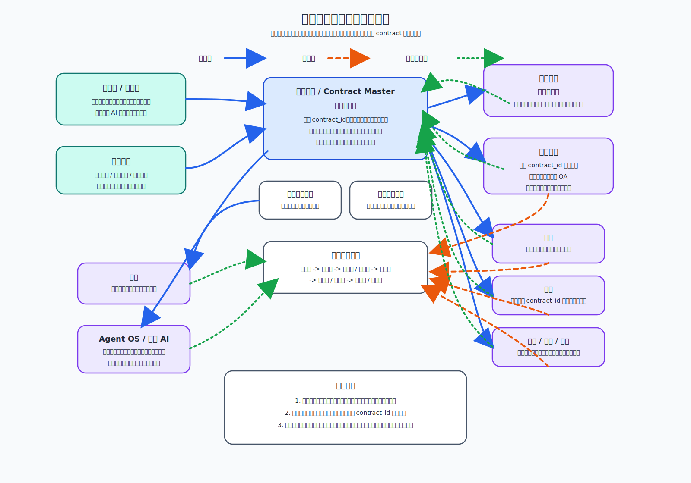

# 合同管理本体子模块 Architecture Design

## 1. 文档说明

本文档是合同管理本体子模块的第一份正式 `Architecture Design`。
它用于收口合同管理本体在平台中的定位、边界、核心对象、关键视图、
主链路协作关系，以及后续下游文档的下沉边界。

### 1.1 输入

- 上游需求基线：[`Requirement Spec`](../../../specifications/cmp-phase1-requirement-spec.md)
- 总平台架构：[`Architecture Design`](../../architecture-design.md)
- 总平台接口边界：[`API Design`](../../api-design.md)
- 总平台共享内部边界：[`Detailed Design`](../../detailed-design.md)
- 总平台实施骨架：[`Implementation Plan`](../../implementation-plan.md)

### 1.2 输出

- 本文：[`Architecture Design`](./architecture-design.md)
- 配套架构图：[`contract-core-architecture.svg`](./contract-core-architecture.svg)
- 为后续该子模块 `API Design`、`Detailed Design`、`Implementation Plan`
  预留明确下沉边界

### 1.3 阅读边界

本文只回答“合同管理本体如何在平台中成立，并作为业务中心驱动周边模块协作”。
不展开以下内容：

- 不写接口路径、字段明细、错误码、回调报文
- 不写内部表结构、索引、缓存键、搜索字段或消息主题
- 不写页面交互细节、编辑器能力细节、AI Prompt 模板细节
- 不写任务排期、资源分配、负责人拆分与里程碑安排

## 2. 架构图

## 3. 子模块定位与设计目标

合同管理本体不是平台里的附属页面，也不是流程、签章或文档模块上的一个
业务外壳。它是整个平台的业务中心，是围绕“同一份合同主档”组织模板、
条款、起草、审批、签章、履约、变更、终止、归档、搜索与 AI 的主链路核心。

本子模块的设计目标如下：

- 让合同主档成为平台唯一业务真相源，不允许各模块各自长出一套合同真相源
- 让模板库、条款库、起草、审批、签章、履约、变更、终止、归档围绕同一
  `contract_id` 主链路收口
- 让文档中心成为文件真相源，但不替代合同主档的业务真相地位
- 让流程引擎通过 `contract_id` 绑定合同并提供审批运行能力，而不拥有合同主档
- 让条款库成为正式能力底座，既服务模板和起草，也作为后续合同 AI 的基础语义层
- 让多语言能力在合同对象、模板、条款、视图与检索链路中成为正式架构约束
- 让默认主审批路径优先走 `OA`，同时保持平台流程引擎作为一期正式承接能力

## 4. 在总平台中的边界

### 4.1 子模块拥有的内容

- 合同主档及其一级业务身份
- 合同生命周期主状态与关键业务状态汇总
- 合同创建、起草、审批发起、签署发起、履约跟踪、变更、终止、归档发起的
  业务主链路编排
- 模板库、条款库与起草入口的业务归口
- 合同台账视图、合同详情视图与合同时间线视图的业务组织语义
- 面向搜索、统计、AI、通知等周边能力的合同业务投影出口

### 4.2 子模块不拥有的内容

- 不拥有文件对象真相与文件版本链真相，这些归文档中心治理
- 不拥有流程定义、流程实例与审批任务运行时真相，这些归流程引擎治理
- 不拥有签章文件介质、归档介质、搜索索引、AI 推理运行时本体
- 不复制履约、变更、终止、归档等模块内部过程数据为第二份合同主档
- 不允许周边模块绕开合同主档自行维护正式合同业务身份与主状态

### 4.3 与总平台的关系判断

- 合同管理本体是平台业务中心，周边模块围绕 `contract` 运行，而不是反过来
- 合同主档负责回答“这份合同在业务上是谁、处于什么阶段、当前应做什么”
- 文档中心负责回答“这份合同相关文件是什么、版本是什么、当前可读对象是什么”
- 流程引擎负责回答“这份合同当前审批运行到哪里、由谁处理、结果如何”
- 签章、履约、变更、终止、归档、搜索、AI 都只能围绕合同主档挂接、回写
  或消费，不能反向成为合同一级真相源

## 5. 核心对象与视图边界

### 5.1 合同主档

合同主档是平台合同业务真相源。
它不是文档附件集合，也不是流程摘要记录，而是合同一级身份与业务状态的
正式承载对象。

合同主档在架构层至少承担以下语义：

- 统一合同身份与 `contract_id`
- 合同编号、合同名称、合同类型、相对方、金额、币种、责任组织等核心业务属性
- 当前生命周期状态与关键业务里程碑
- 当前主版本引用、当前审批摘要、当前签署摘要、当前履约摘要、当前归档摘要
- 与模板、条款、正文、附件、审批实例、签章结果、履约记录、变更记录、
  终止记录、归档记录的稳定关联

原则上，任何周边模块都只能挂接、消费、回写合同主档，不能绕过它建立新的
“合同业务主记录”。

### 5.2 合同台账视图

合同台账视图是面向列表管理、检索、筛选、统计与经营观察的读模型视图。
它不是第二份合同主档。

其边界如下：

- 负责按列表形式展示合同摘要、状态、责任归属、金额、期限、风险和待办
- 可聚合审批、签章、履约、变更、终止、归档等摘要字段
- 可按多语言展示名称、类型、状态文案与字段标签
- 允许为查询性能生成读模型、索引或缓存投影
- 不得拥有独立于合同主档之外的业务编辑真相

### 5.3 合同详情视图

合同详情视图是围绕单一 `contract_id` 组织业务信息、文件信息、流程信息与
时间线信息的聚合视图。
它是统一工作台，不是新的状态主档。

其边界如下：

- 以合同主档为中心展示基础信息、生命周期状态、关键动作入口与时间线
- 读取文档中心提供的正文、附件、版本与预览引用
- 读取流程引擎提供的审批摘要与实例状态
- 读取签章、履约、变更、终止、归档等模块的当前摘要与历史记录
- 可承载 AI 分析、条款比对、风险提示、知识问答等辅助能力入口
- 所有展示结果都应回指正式源头，不在详情页内形成私有状态

### 5.4 模板库 / 条款库

模板库与条款库都属于合同管理本体的正式能力边界。

模板库的定位：

- 负责合同范本分类、版本、启停与起草入口引用
- 服务合同快速创建与标准化生成
- 是合同主档形成前的重要上游对象，但不替代合同主档

条款库的定位：

- 负责标准条款、可复用条款片段及其治理
- 服务模板编排、起草引用、合同审查与差异识别
- 是后续合同 AI 的重要底座，不是可有可无的辅助资料区
- 应支持多语言内容表达与统一条款语义归口

两者关系原则如下：

- 模板可引用条款，但模板与条款都不直接等于合同实例
- 起草入口基于模板库 / 条款库生成或辅助生成候选合同内容
- 合同一旦创建，业务主语义转入合同主档；模板与条款继续作为来源与参考对象

### 5.5 生命周期状态

生命周期状态是合同主档的核心业务语义，不应分散到多个模块各自解释。

架构层建议将其理解为统一主链路下的阶段收口，而不是此处固化细粒度状态机：

1. 起草中
2. 审批中
3. 待签署 / 签署中
4. 已生效
5. 履约中
6. 变更中
7. 终止中 / 已终止
8. 归档中 / 已归档

补充原则如下：

- 生命周期主状态由合同主档统一持有
- 周边模块可持有自己的过程状态，但必须可映射并回写合同主状态或里程碑
- 状态切换必须可追踪到触发来源，如审批结果、签章完成、履约异常、变更审批、
  终止审批、归档完成
- 多语言环境下，状态显示文案可多语，但状态语义编码必须统一

## 6. 与文档中心的关系

合同管理本体与文档中心的关系是“业务真相源绑定文件真相源”，而不是互相替代。

关系原则如下：

- 合同主档是业务真相源
- 文档中心是文件真相源
- 合同主档通过稳定引用关系关联正文、附件、补充协议、签章稿、归档稿等文件对象
- 文件版本变化由文档中心治理，合同主档只维护当前业务有效引用与摘要
- 文档中心不能拥有独立于合同主档之外的合同业务主状态
- 合同管理本体不能绕过文档中心自建文件版本链或文件介质真相

因此，合同详情视图读取文档中心的文件对象与版本链，但“这份文件属于哪份合同、
当前在业务上算不算有效主版本、当前合同走到哪个阶段”仍由合同主档解释。

## 7. 与流程引擎的关系

流程引擎是合同管理本体的重要协作模块，但它不拥有合同主档。

关系原则如下：

- 流程引擎通过 `contract_id` 绑定合同业务对象
- 默认主审批路径优先走 `OA`
- 平台流程引擎是一期正式能力，不能降级为仅预留接口的后备壳层
- 无论审批主路径来自 `OA` 还是平台流程引擎，审批结果都必须回写合同主档
- 流程定义、流程实例、审批任务与组织绑定归流程引擎治理
- 合同主档负责承接审批发起条件、审批摘要、审批结果映射与后续业务动作

因此，流程引擎拥有“流程运行时真相”，但不拥有“合同业务真相”。

## 8. 与签章、履约、变更、终止、归档、搜索、AI 的关系

### 8.1 与签章的关系

- 合同主档驱动签章申请发起与签章前置条件判断
- 签章模块消费合同主档与文档中心提供的合同上下文和签署输入稿
- 签章完成结果必须回写合同主档的签署摘要、生效判断与时间线
- 签章模块不能独立维护“正式合同已签”作为唯一业务事实而不回写合同主档

### 8.2 与履约的关系

- 履约模块围绕同一 `contract_id` 记录履约计划、节点执行、凭证与异常
- 履约模块可以维护过程记录，但合同主档统一汇总履约阶段、风险与关键里程碑
- 履约异常、逾期、完成等关键结果必须回写合同主档摘要与时间线

### 8.3 与变更的关系

- 变更模块围绕已生效或有效合同发起变更申请与审批
- 变更结果可以生成新的业务有效版本或补充协议关系
- 变更历史由变更模块沉淀，但合同主档统一持有当前有效合同业务状态

### 8.4 与终止的关系

- 终止模块负责终止申请、原因、材料、审批与善后处理记录
- 终止完成后必须回写合同主档状态、终止摘要与时间线
- 终止不等于删除，合同主档仍然保留完整业务身份与历史追踪能力

### 8.5 与归档的关系

- 归档模块围绕合同主档收集合规归档输入集
- 归档记录、借阅、归还等档案过程真相归归档模块治理
- 归档完成结果必须回写合同主档的归档状态、归档摘要与归档引用
- 归档不能独立形成一份与合同主档脱钩的合同一级业务记录

### 8.6 与搜索的关系

- 搜索消费合同主档摘要、文档中心文本、流程摘要及其他派生信息构建检索能力
- 搜索索引是读模型，不是合同真相源
- 搜索命中结果应最终回到合同台账视图或合同详情视图
- 多语言场景下，搜索能力应支持跨语言或按语言维度返回合同结果

### 8.7 与 AI 的关系

- 合同 AI 必须围绕合同主档、模板库、条款库与文档中心正式输入运行
- 条款库是合同 AI 的重要底座之一，用于条款推荐、比对、风险识别与问答 grounding
- AI 输出是辅助结论，不得直接覆盖合同主档正式业务真相
- AI 可消费合同详情聚合上下文，但结果回写必须经过受控业务动作与审计
- 多语言能力应覆盖 AI 输入理解、输出生成与术语一致性治理

## 9. 业务主链路

从架构层看，合同管理本体的业务主链路应统一收口为一条围绕 `contract` 的
主链，而不是被多个模块拆成互不相认的局部流程。

### 9.1 建立主链

1. 用户从模板库、条款库或空白起草入口发起合同创建。
2. 系统形成合同主档并分配 `contract_id`。
3. 起草内容与附件写入文档中心，形成正式文件引用关系。
4. 合同主档记录来源模板、来源条款、正文引用、附件引用与起草摘要。

### 9.2 审批与签署主链

1. 起草完成后，合同主档触发审批发起条件判断。
2. 流程引擎按 `contract_id` 启动审批主路径，默认优先走 `OA`。
3. 审批过程中的关键状态、结论与异常持续回写合同主档摘要。
4. 审批通过后，由合同主档驱动签章或纸质签约备案流程。
5. 签署完成后，结果回写合同主档并推动合同进入生效阶段。

### 9.3 履约、变更、终止、归档主链

1. 已生效合同进入履约跟踪。
2. 履约异常、付款节点、交付节点、服务节点等围绕同一 `contract_id` 运行。
3. 需要调整时，发起变更；需要结束时，发起终止。
4. 变更、终止结果继续回写合同主档状态、摘要与时间线。
5. 满足归档条件后，由归档模块收口归档资料并回写归档结果。

### 9.4 统一状态回写原则

- 业务流由合同管理本体主导
- 状态流由合同主档统一收口
- 数据回写流由周边模块回写合同主档摘要、时间线和里程碑
- 文件版本回写文档中心，流程运行回写流程引擎，二者再通过稳定摘要回写合同主档
- 搜索、统计、AI 等增强能力只消费和投影，不反向成为业务主档

## 10. 安全与扩展考虑

### 10.1 安全考虑

- 合同主档的查看、编辑、发起审批、签章、变更、终止、归档等动作必须受权限控制
- 合同生命周期关键状态切换必须留痕，并能追踪到触发来源与责任人
- 合同与文件、流程、签章、归档的引用关系必须可审计、可追溯、可回放
- AI 输出、搜索结果与聚合摘要不得绕过正式权限直接暴露敏感合同信息
- 多语言支持不能破坏合同编号、状态编码、组织归属、审计字段等统一语义主键

### 10.2 扩展考虑

- 后续新增更多合同类型时，应继续复用统一合同主档与生命周期框架
- 后续新增更多条款能力、模板能力或 AI 能力时，应继续围绕条款库和合同主链扩展
- 后续新增更多签署方式、履约玩法、归档介质或搜索策略时，不应改写合同主档
  作为业务真相源的定位
- 多语言扩展应以统一语义编码、多语言展示资源和多语言检索策略实现，
  而不是复制多套合同对象

## 11. 下沉到该模块 `API Design` / `Detailed Design` /
`Implementation Plan` 的内容边界

### 11.1 下沉到后续 `API Design` 的内容

- 合同主档、台账、详情、模板、条款、生命周期动作等资源边界
- 与文档中心、流程引擎、签章、履约、变更、终止、归档、搜索、AI 的模块级接口契约
- 多语言资源读取、语言切换与多语言字段对外呈现契约

### 11.2 下沉到后续 `Detailed Design` 的内容

- 合同主档模型、视图模型、引用模型、状态映射模型
- 模板库、条款库、详情聚合、状态回写、时间线组织的内部设计
- 与文档中心、流程引擎及其他周边模块的时序、补偿、幂等与一致性策略

### 11.3 下沉到后续 `Implementation Plan` 的内容

- 合同主链分阶段落地顺序
- 模板库、条款库、起草、审批、签章、履约、变更、终止、归档的实施拆分
- 与 `OA`、文档中心、搜索、AI、多语言支持的联调安排与依赖关系

### 11.4 不应继续留在本架构文档中的内容

- 具体 API 路径、字段结构、错误码与回调协议
- 具体库表、索引、缓存、搜索映射与消息主题
- 具体页面交互、组件布局、编辑器工具栏或 AI Prompt 细节
- 具体任务排期、工时、负责人和发布计划

## 12. 本文结论

合同管理本体子模块是平台的业务中心。
其成立前提不是“拥有一切”，而是“统一持有合同业务真相，并把周边模块稳定
挂接到同一合同主链路上”。

在这一前提下：

- 合同主档是业务真相源
- 文档中心是文件真相源
- 流程引擎通过 `contract_id` 绑定合同而不拥有合同主档
- 模板库、条款库、起草、审批、签章、履约、变更、终止、归档围绕同一合同主链路收口
- 搜索与 AI 只能消费、增强、辅助，不能反向成为合同一级真相源

这也是后续该子模块继续展开 `API Design`、`Detailed Design` 与
`Implementation Plan` 的稳定前提。
