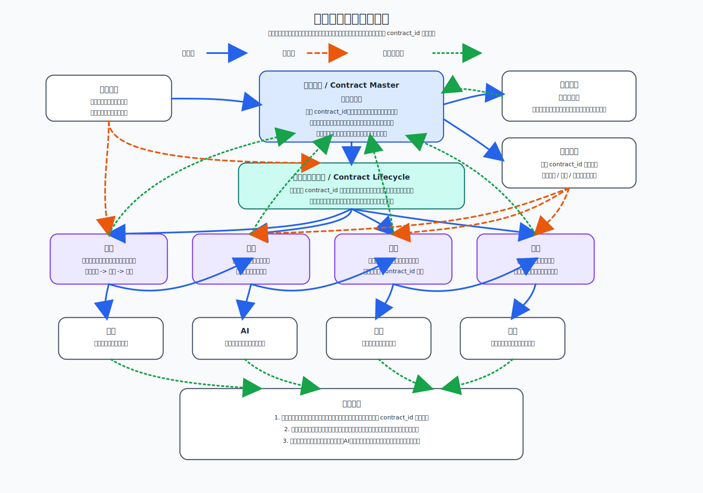

# 合同后续业务组 Architecture Design

## 1. 文档说明

本文档是“合同后续业务组 / `contract-lifecycle`”的第一份正式
`Architecture Design`。
它用于收口履约、变更、终止、归档这组合同后续业务能力在平台中的共同边界、
共享主链关系，以及它们与合同主档、文档中心、流程引擎、搜索、AI、审计、
通知之间的稳定挂接方式。

### 1.1 输入

- 上游需求基线：[`Requirement Spec`](../../../specifications/cmp-phase1-requirement-spec.md)
- 总平台架构：[`Architecture Design`](../../architecture-design.md)
- 总平台接口边界：[`API Design`](../../api-design.md)
- 总平台共享内部边界：[`Detailed Design`](../../detailed-design.md)
- 总平台实施骨架：[`Implementation Plan`](../../implementation-plan.md)
- 合同管理本体架构：[`contract-core Architecture Design`](../contract-core/architecture-design.md)
- 文档中心架构：[`document-center Architecture Design`](../document-center/architecture-design.md)
- 流程引擎架构：[`workflow-engine Architecture Design`](../workflow-engine/architecture-design.md)

### 1.2 输出

- 本文：[`Architecture Design`](./architecture-design.md)
- 配套架构图：[`contract-lifecycle-architecture.svg`](./contract-lifecycle-architecture.svg)
- 为后续本业务组的 `API Design`、`Detailed Design`、`Implementation Plan`
  预留明确下沉边界

### 1.3 阅读边界

本文只回答“履约、变更、终止、归档这一组后续业务能力如何围绕同一合同主链
成立，并与平台其他正式模块协作”。
不展开以下内容：

- 不写接口路径、字段明细、错误码、回调协议
- 不写库表、索引、消息主题、搜索字段、任务编排细节
- 不写节点级状态机、审批表单、归档目录、文件封包格式等 Detailed 细节
- 不写里程碑排期、工时拆分、负责人分配等 Plan 内容

## 2. 架构图

## 3. 子模块组定位与设计目标

“合同后续业务组 / `contract-lifecycle`”不是四个彼此割裂的小系统集合，
也不是在签章完成后各自复制一份合同数据继续运行的后处理区。
它是合同进入生效阶段之后，围绕同一 `contract_id` 持续推进履约、变更、
终止、归档的组合业务层。

其定位是：

- 承接签章结果回写后的合同后续主链路
- 让履约、变更、终止、归档都围绕同一合同主档持续推进
- 让后续业务过程各归其模块，但不长出第二份合同业务真相源
- 让搜索、AI、审计、通知能够消费稳定摘要、时间线与里程碑，而不是各读一套
  私有过程数据

本业务组的设计目标如下：

- 合同主档始终是业务真相源，统一持有合同一级身份、主状态和阶段归口
- 文档中心始终是文件真相源，统一持有履约凭证、变更文件、终止材料、归档稿等
  文件对象与版本链
- 流程引擎始终通过 `contract_id` 绑定合同并提供审批运行能力，不拥有合同主档
- 履约、变更、终止、归档都围绕同一主链推进，不创建新的合同主档
- 归档记录属于归档模块真相，但不能替代合同主档的业务真相地位
- 变更、终止是原合同主链上的新阶段推进，不是另起一份合同业务主记录

## 4. 在总平台中的边界

### 4.1 本业务组拥有的内容

- 合同生效之后的后续业务阶段编排语义
- 履约、变更、终止、归档四类业务能力的过程归口
- 面向合同主档回写的阶段摘要、里程碑、时间线与风险信号
- 面向搜索、AI、审计、通知输出的稳定事件摘要与消费出口

### 4.2 本业务组不拥有的内容

- 不拥有合同一级业务身份与生命周期主状态真相，这些归合同主档统一持有
- 不拥有文件对象、文件版本链与文件介质真相，这些归文档中心治理
- 不拥有流程定义、流程实例、审批任务运行时真相，这些归流程引擎治理
- 不把履约记录、变更记录、终止记录、归档记录升级为新的合同业务主档
- 不让搜索索引、AI 结论、通知记录、审计日志倒置为业务真相源

### 4.3 与总平台的关系判断

- 合同主档回答“这份合同当前在业务上是谁、处于什么后续阶段”
- 本业务组回答“围绕这份合同，后续业务正在如何推进、出现了哪些里程碑与风险”
- 文档中心回答“后续业务相关文件是什么、版本是什么、当前可读对象是什么”
- 流程引擎回答“变更、终止、归档等需要审批的流程当前运行到哪里”
- 搜索、AI、审计、通知只消费本业务组输出的稳定摘要与里程碑，不成为新的主档

## 5. 关键业务能力划分

### 5.1 履约

履约是合同在生效之后的默认主路径。
签章结果回写并完成生效判断后，合同进入履约阶段，后续交付、收款、付款、
验收、服务、质保、异常跟踪等活动都围绕同一 `contract_id` 运行。

履约在架构层承担的职责如下：

- 维护履约计划、履约节点、执行记录、凭证引用与异常记录
- 向合同主档回写履约进展摘要、关键里程碑、履约风险与完成判断
- 为变更、终止提供当前履约上下文、未完成事项与风险依据
- 为搜索、AI、审计、通知提供稳定的履约摘要与事件出口

履约不拥有合同主档，只拥有履约过程真相。

### 5.2 变更

变更用于在原合同主链上推进合同内容、金额、期限、范围、责任安排等业务调整。
它不是创建一份新的合同主档，而是在同一 `contract_id` 下形成新的有效业务阶段、
新的变更记录，必要时关联新的补充协议或新的业务有效版本。

变更在架构层承担的职责如下：

- 发起并管理变更申请、变更原因、影响评估与审批过程
- 关联变更正文、补充协议、附件与批注说明等文件引用
- 在变更完成后回写合同主档的当前有效摘要、变更里程碑与时间线
- 向履约、终止、归档暴露变更后的当前业务有效状态

### 5.3 终止

终止用于在原合同主链上推进合同提前结束、解除、撤销、终止执行等业务收口。
它不是删除合同，也不是形成一份新的终止合同主档，而是在同一 `contract_id`
下记录终止申请、依据材料、审批结论、后续善后与最终业务状态。

终止在架构层承担的职责如下：

- 管理终止申请、终止原因、终止依据、责任划分与善后处理记录
- 关联终止审批、终止协议、终止说明、交接证明等文件引用
- 在终止完成后回写合同主档状态、终止摘要、终止时间线与后续限制
- 对搜索、AI、审计、通知输出稳定的终止事件与结果摘要

### 5.4 归档

归档是合同主链在满足归档条件后的正式收口能力。
归档记录、借阅、归还、调阅等档案过程真相归归档模块治理，但它不能替代合同
主档对该合同业务身份、业务阶段和业务历史的真相解释权。

归档在架构层承担的职责如下：

- 收集归档输入集，包括正文、附件、签章稿、变更材料、终止材料、履约凭证等
- 管理归档记录、归档批次、调阅借阅、归还和归档状态过程真相
- 在归档完成后回写合同主档的归档摘要、归档里程碑与归档引用
- 对审计、通知、搜索、AI 暴露受控的归档摘要，而不是直接替代合同主档

### 5.5 共享支撑层

四类后续业务能力虽然过程不同，但在架构层共享以下支撑能力：

- 统一的 `contract_id` 绑定与合同上下文读取能力
- 统一的摘要回写、时间线沉淀与里程碑发布能力
- 统一的文档引用能力，所有正式文件都回指文档中心
- 统一的流程挂接能力，所有正式审批都通过流程引擎绑定到合同
- 统一的事件输出能力，供搜索、AI、审计、通知消费稳定摘要

## 6. 与合同主档的关系

合同主档是本业务组运行的前提，不是可选依赖。

关系原则如下：

- 合同主档是业务真相源，统一持有 `contract_id`、当前生命周期主状态和一级业务身份
- 本业务组中的履约、变更、终止、归档都只能围绕同一 `contract_id` 运行
- 本业务组可维护各自过程记录，但必须回写合同主档的稳定摘要、里程碑与时间线
- 变更、终止推进的是原合同主链的新业务阶段，而不是创建新的合同主档
- 归档完成后，合同主档仍保留业务真相地位；归档记录不能取代合同主档

因此，本业务组的所有能力都属于“围绕合同主档运行的后续业务层”，而不是
“在合同主档之外平行存在的第二套合同系统”。

## 7. 与文档中心的关系

本业务组与文档中心的关系是“后续业务过程绑定文件真相源”，而不是各模块
本地维护一套私有文件体系。

关系原则如下：

- 文档中心是文件真相源
- 履约凭证、交付证明、验收材料、补充协议、终止协议、归档稿等正式文件对象
  都应进入文档中心治理
- 本业务组只维护业务语义上的文件引用、摘要与使用关系，不维护文件版本链真相
- 文件版本变化由文档中心治理，本业务组只读取正式引用并在必要时回写业务摘要
- 归档模块可拥有归档记录真相，但归档稿、封包、归档材料引用仍应回指文档中心

## 8. 与流程引擎的关系

流程引擎是本业务组的重要协作模块，但它通过 `contract_id` 绑定合同，不拥有
合同主档。

关系原则如下：

- 变更、终止、归档等需要审批的正式动作，通过流程引擎发起与运行
- 履约过程也可按需要触发围绕合同的审批或协同流程，但流程实例真相仍归流程引擎
- 流程引擎只持有流程定义、实例、任务、节点结果与运行时状态
- 流程结论必须回写合同主档以及对应后续业务模块的阶段摘要
- 合同主档负责承接流程结果并更新生命周期阶段，不允许流程实例单独解释合同主状态

## 9. 与搜索、AI、审计、通知的关系

搜索、AI、审计、通知都不直接把各业务模块的内部过程数据当作唯一来源，
而是消费本业务组围绕同一合同主链输出的稳定摘要与里程碑。

### 9.1 搜索

- 消费履约、变更、终止、归档的稳定摘要、时间线与关键标签
- 检索入口最终回到合同台账、合同详情或归档调阅入口
- 搜索索引是读模型，不是业务真相源

### 9.2 AI

- 消费合同主档摘要、本业务组稳定摘要与文档中心提供的正式文件上下文
- 用于履约风险识别、变更影响分析、终止依据辅助判断、归档完整性辅助检查等场景
- AI 输出是辅助结论，不得直接覆盖合同主档或本业务组过程真相

### 9.3 审计

- 覆盖履约事件、变更申请、终止处理、归档操作及其回写动作
- 审计日志是治理证据，不是业务真相源
- 应能串联合同主档时间线、流程节点、文件引用与模块动作来源

### 9.4 通知

- 消费履约节点到期、变更待办、终止审批、归档完成等稳定里程碑事件
- 通知记录是投递结果，不是业务状态真相
- 通知应围绕同一 `contract_id` 组织消息上下文，避免形成孤立事件岛

## 10. 履约 / 变更 / 终止 / 归档主链路

从架构层看，合同后续业务组应收口为一条围绕同一 `contract_id` 运行的主链，
其核心不是四条平行支线，而是“签章完成后进入履约，再根据业务需要推进变更、
终止与归档”。

### 10.1 签章完成到履约启动

1. 签章模块完成签署并回写签章结果。
2. 合同主档完成生效判断并进入已生效 / 履约阶段。
3. 履约模块围绕同一 `contract_id` 建立履约计划、履约节点和履约摘要。

### 10.2 履约主路径

1. 业务用户围绕履约计划持续记录执行进展、凭证与异常。
2. 履约模块向合同主档回写里程碑、风险、完成情况与时间线。
3. 搜索、AI、审计、通知消费这些稳定摘要与事件。

### 10.3 变更推进路径

1. 在履约中或生效后发现需要调整合同内容时，发起变更。
2. 变更通过流程引擎按 `contract_id` 运行审批。
3. 变更结果与相关文件回写文档中心和合同主档。
4. 合同主档更新当前有效业务摘要，本业务组继续围绕同一合同推进后续事项。

### 10.4 终止推进路径

1. 在履约中或变更后出现提前结束需求时，发起终止。
2. 终止通过流程引擎运行审批，并关联终止材料与终止协议。
3. 终止完成后，合同主档回写终止状态、终止摘要与时间线。
4. 后续如满足条件，可继续推进归档收口。

### 10.5 归档收口路径

1. 合同达到归档条件后，归档模块收集完整归档输入集。
2. 归档模块形成归档记录并管理调阅、借阅、归还等档案过程。
3. 归档完成后，将归档摘要、归档引用与归档里程碑回写合同主档。
4. 搜索、AI、审计、通知继续消费稳定归档摘要，但不以归档记录替代合同主档。

### 10.6 统一主链原则

- 业务流：签章完成 -> 生效 -> 履约 -> 变更 / 终止 -> 归档
- 状态流：合同主档统一收口各阶段主状态与关键里程碑
- 数据回写流：履约、变更、终止、归档把稳定摘要、时间线与结果回写合同主档
- 文件回写流：正式文件对象与版本回写文档中心
- 流程回写流：审批运行结果回写流程引擎并映射到合同主档与业务组摘要

## 11. 安全与扩展考虑

### 11.1 安全考虑

- 履约、变更、终止、归档动作必须受合同级权限、组织权限与角色权限控制
- 关键状态切换必须可追踪到触发模块、触发人、流程结论和关联文件引用
- 履约凭证、终止协议、归档材料等敏感文件必须通过文档中心的正式权限链路访问
- 搜索、AI、通知只能消费受控摘要，不得绕过权限读取底层敏感过程数据
- 审计必须能串联 `contract_id`、流程、文件、业务动作和回写结果

### 11.2 扩展考虑

- 后续如将履约、变更、终止、归档继续拆成独立模块文档，也必须保留同一
  `contract_id` 主链前提
- 后续新增更多后续业务玩法时，应复用摘要回写、时间线与事件输出机制
- 后续新增更多外部协同、风控、报表或智能能力时，应继续消费稳定摘要与里程碑，
  不能要求各业务模块重复暴露私有真相模型
- 如未来增加更多归档介质或归档流转方式，也不能改变归档记录与合同主档的真相关系

## 12. 需要下沉到后续 `API Design` / `Detailed Design` /
`Implementation Plan` 的内容边界

### 12.1 下沉到后续 `API Design` 的内容

- 履约、变更、终止、归档的模块级资源边界与动作边界
- 与合同主档、文档中心、流程引擎、搜索、AI、审计、通知之间的对外契约
- 稳定摘要、里程碑、时间线、事件出口的对外读取与消费契约

### 12.2 下沉到后续 `Detailed Design` 的内容

- 履约计划、变更记录、终止记录、归档记录及其内部模型边界
- 摘要回写、时间线组织、状态映射、事件发布、幂等与补偿策略
- 模块间时序、失败恢复、权限校验、文档引用规则与流程映射细节

### 12.3 下沉到后续 `Implementation Plan` 的内容

- 本业务组分阶段建设顺序与依赖关系
- 履约、变更、终止、归档能力的实施拆分与联调顺序
- 与文档中心、流程引擎、搜索、AI、审计、通知的联调安排

### 12.4 不应继续留在本架构文档中的内容

- 具体 API 路径、字段结构、事件报文和回调协议
- 具体库表、索引、缓存、搜索映射与消息主题设计
- 具体审批节点配置、归档封包结构、文档目录规则与页面交互流程
- 具体排期、工时、负责人和发布计划

## 13. 本文结论

合同后续业务组是平台合同主链在签章完成之后的正式延伸层。
它的成立前提不是让履约、变更、终止、归档各自拥有一份合同真相，而是让四类
能力共同围绕同一 `contract_id` 运行，并把稳定摘要、里程碑和时间线回写到
合同主档。

在这一前提下：

- 合同主档是业务真相源
- 文档中心是文件真相源
- 流程引擎通过 `contract_id` 绑定合同，不拥有合同主档
- 签章结果回写后，合同进入履约阶段
- 变更、终止是在原合同主链上推进新的业务阶段，不是创建新的合同主档
- 归档记录属于归档模块真相，但不能替代合同主档业务真相
- 搜索、AI、审计、通知都只消费稳定摘要与里程碑

这也是后续继续细拆履约、变更、终止、归档独立文档之前的统一架构基线。
