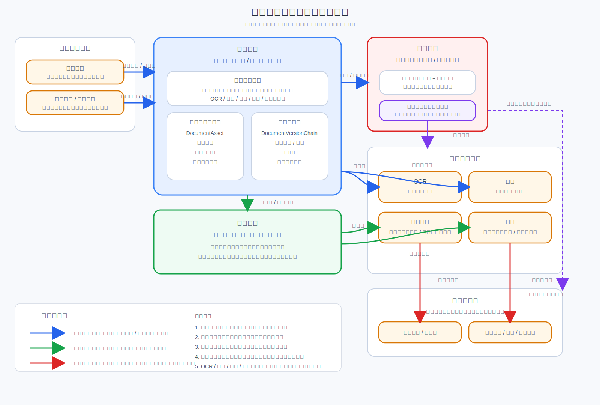

# 文档中心与文档协作子模块 Architecture Design

## 1. 文档说明

本文档是 `CMP` 文档中心与文档协作方向的第一份正式
`Architecture Design`。
它用于收口文档中心作为平台底座级能力的定位，明确文档协作作为其上层
正式子模块的成立方式，并说明它们与合同主档、流程引擎、电子签章、
`OCR`、搜索、加密、归档之间的稳定挂载关系。

### 1.1 输入

- 上游需求基线：[`Requirement Spec`](../../../specifications/cmp-phase1-requirement-spec.md)
- 总平台架构：[`Architecture Design`](../../architecture-design.md)
- 总平台接口边界：[`API Design`](../../api-design.md)
- 总平台共享内部边界：[`Detailed Design`](../../detailed-design.md)
- 总平台实施骨架：[`Implementation Plan`](../../implementation-plan.md)

### 1.2 输出

- 本文：[`Architecture Design`](./architecture-design.md)
- 配套架构图：[`document-center-architecture.svg`](./document-center-architecture.svg)
- 为后续模块级 `API Design`、`Detailed Design`、`Implementation Plan`
  预留明确下沉边界

### 1.3 阅读边界

本文只回答“文档中心与文档协作在平台中如何成立、如何挂载、如何协作”。
不展开以下内容：

- 不写接口路径、字段明细、错误码和回调报文
- 不写库表设计、索引设计、对象存储目录规划或预览格式细节
- 不写 `OCR` 识别参数、搜索索引字段、签章坐标协议或加密算法实现
- 不写实施排期、里程碑、工时、负责人拆分

## 2. 架构图

## 3. 子模块定位与设计目标

文档中心不是一个“上传附件”的页面能力，而是 `CMP` 平台底座中的
文件与内容真相层。它统一管理合同正文、附件、版本、预览入口、
批注锚点、修订关系，以及 `OCR` / 搜索 / 签章 / 加密 / 归档所依赖的
输入对象。

文档协作建立在文档中心之上，是平台内正式子模块。它围绕同一份文件对象
真相提供批注、修订、比对、协同处理等能力，而不是再生成第二套文件体系。

本方向的设计目标如下：

- 让文档中心成为平台唯一文件对象真相源，而不是各模块各自存附件
- 让文档协作明确依附文档中心成立，能力增强但不改写真相归属
- 让合同正文、合同附件、过程稿、签章稿、归档稿都纳入同一版本链治理
- 让 `OCR`、搜索、签章、加密、归档通过稳定挂载关系复用同一文档对象
- 让加密能力挂在文档读写路径上，默认平台内受控使用，管理端授权解密下载
  作为受控例外
- 让流程、签章、归档等业务状态能够回写平台主链，而不把文件状态散落到
  各子模块私域

## 4. 在总平台中的边界

### 4.1 文档中心拥有的内容

- 文件对象主记录与业务绑定关系
- 文件版本链与主版本指针
- 合同正文与附件的统一承载入口
- 统一预览入口与预览产物引用关系
- 批注锚点与修订关系的底层附着能力
- `OCR` / 搜索 / 签章 / 加密 / 归档输入对象的统一编排入口

### 4.2 文档协作拥有的内容

- 面向同一文档对象的批注协作能力
- 修订建议、修订链路与差异对照能力
- 协作过程中的评论、处理状态、协同上下文
- 与审批、签署、归档过程联动的文档协作视图

### 4.3 本方向不拥有的内容

- 不拥有合同主档，不定义合同一级业务真相
- 不拥有审批流定义与审批实例真相
- 不拥有电子签章申请、印章治理或签署规则真相
- 不拥有归档记录一级真相，只提供归档输入对象与版本依据
- 不允许其他模块绕过文档中心自建文件真相源与版本链

### 4.4 与总平台的关系判断

- 文档中心属于平台底座层，不是某个业务页面的附件子能力
- 文档协作属于平台正式子模块，挂在文档中心之上
- 合同主档通过稳定业务绑定关系引用文档中心对象，但不接管文件真相
- 流程引擎、签章、`OCR`、搜索、加密、归档都围绕文档中心挂接，不直接把
  文件副本升级为各自真相源

## 5. 关键组件划分

文档中心与文档协作在架构层按以下组件划分：

1. `Document Asset Registry`
   负责文件对象主记录、业务归属、文档类型与主版本引用。
2. `Document Version Chain`
   负责版本追加、版本切换、修订关系引用、来源继承与链路追踪。
3. `Document Preview Gateway`
   负责统一预览入口、预览产物引用、预览可访问控制。
4. `Annotation Anchor Service`
   负责批注锚点、定位片段、锚点有效性与跨版本附着关系。
5. `Revision Relation Service`
   负责修订建议、版本差异、替代关系、派生关系与协作修订链。
6. `Document Collaboration Workspace`
   负责面向业务用户的批注、协作处理、修订确认与协同视图。
7. `Document Ingress Orchestrator`
   负责接收正文上传、附件导入、流程产物、签章产物、归档产物等写入请求。
8. `Document Capability Adapters`
   负责把 `OCR`、搜索、签章、加密、归档等能力稳定挂接到同一文档对象流转。

这些组件只定义职责区，不在本层写死内部类图、表设计、任务主题或接口协议。

## 6. 文件对象真相与版本链原则

文档中心的第一原则是“文件对象真相唯一”。
在 `CMP` 内，任何合同正文、附件、签章稿、归档稿、识别输入稿，只要被平台
视为正式文档对象，就必须进入文档中心统一治理。

核心原则如下：

- 文件对象真相由文档中心持有，其他模块只持有引用、摘要或派生结果
- 版本链必须在文档中心内部闭环维护，不能由审批、签章、归档各自维护
  一条私有版本链
- 合同正文与附件属于同一文件治理体系，只是在业务角色上不同
- 批注锚点、修订关系依附文件对象与版本，不脱离版本链独立漂浮
- 预览入口是版本视图，不是第二份文件真相
- `OCR` 文本、搜索索引、签章结果、归档介质都只能是围绕文档对象形成的
  派生物或消费物，不能倒置为新的主对象

因此，“业务模块本地存一个附件表，再在需要时同步到文档中心”的方式不成立。
文档中心必须是写入起点或正式收口点，文件真相不能散落在别处后再事后汇总。

## 7. 与合同主档的关系

合同主档与文档中心的关系是“业务主档绑定文件主档”，而不是互相替代。

- 合同主档负责合同一级业务身份、生命周期与业务状态
- 文档中心负责该合同相关文件对象及其版本链
- 一个合同可绑定多个文档对象，包括正文、附件、补充协议、签章稿、归档稿
- 合同详情页读取的是文档中心提供的当前版本视图与协作视图，不直接持有
  文件真相
- 合同状态变化可以触发文档动作，但文件版本变化本身仍由文档中心治理

这种关系保证平台同时拥有“合同业务真相”与“文件内容真相”，且两者边界清晰。

## 8. 与文档协作的关系

文档协作不是独立文件系统，而是建立在文档中心之上的正式子模块。

其关系原则如下：

- 文档协作只围绕文档中心已有文件对象开展批注、修订、评论和协同处理
- 批注必须锚定到文档中心提供的版本与锚点能力
- 修订建议必须落在文档中心的版本链或修订关系模型上
- 协作中形成的“待确认稿”“修订中稿”“协同意见稿”仍然属于文档中心版本链
  上的受控状态，不形成第二套文件真相
- 协作结果一旦被采纳，可驱动主版本切换、审批引用更新、签章输入变更等
  后续动作

因此，文档协作是上层能力增强，不是底层文件归属迁移。

## 9. 与 OCR / 搜索 / 签章 / 加密 / 归档的关系

### 9.1 与 `OCR` 的关系

- `OCR` 输入对象来自文档中心中的受控文件版本
- `OCR` 结果回写为识别结果、结构化提取结果或辅助文本，不覆盖原文件真相
- 如识别失败，只影响能力结果，不改变文件版本链成立性

### 9.2 与搜索的关系

- 搜索索引以文档中心的文件对象与版本为来源
- 索引是派生读模型，不是文件真相源
- 文档版本变更后，索引刷新必须跟随版本变化回收或重建

### 9.3 与电子签章的关系

- 签章模块读取文档中心指定版本作为签章输入稿
- 签章完成后形成新的签章结果稿，并作为文档中心版本链中的正式节点
- 签章状态与签署业务结果回写合同主档、流程摘要与时间线，但文件对象真相
  仍归文档中心

### 9.4 与加密的关系

- 加密模块挂在文档中心写入 / 读取路径上，不脱离文档中心单独成立
- 文件写入文档中心时，进入自动加密与入库校验链路
- 平台内读取时，按权限进行受控自动解密使用
- 默认情况下，密文文档不能脱离平台使用
- 管理端可按部门、人员授予“解密下载”权限，作为受控例外
- 获授权对象执行解密下载后，导出的明文文件可脱离 `CMP` 使用
- 授权、下载、结果与失败原因必须统一纳入审计链路

### 9.5 与归档的关系

- 归档模块从文档中心读取归档所需版本与归档输入集
- 归档形成的归档稿、归档封包或归档介质引用，应继续回收到文档中心治理
- 归档记录与借阅状态属于归档模块真相，文档中心提供文件依据与版本依据

## 10. 运行时主链路

### 10.1 文档写入主链路

1. 合同起草、附件上传、流程产物或签章产物发起写入请求。
2. `Document Ingress Orchestrator` 接收写入并建立文件对象绑定。
3. 加密模块在写入路径执行入库校验与自动加密。
4. 文档中心登记文件对象、版本链、预览入口与能力挂接信息。
5. 如需要，向 `OCR`、搜索、协作工作区投递派生处理。
6. 文档对象成为平台后续审批、签章、归档、检索的正式输入源。

### 10.2 文档协作主链路

1. 业务用户基于合同主档进入某个文档对象的协作视图。
2. 文档协作模块读取文档中心当前版本、锚点与修订关系。
3. 用户发起批注、修订建议、协作处理或版本比对。
4. 协作结果回写到批注锚点、修订关系与版本链引用。
5. 如协作结论影响流程、签章或合同正文基线，则触发后续业务回写。

### 10.3 文档读取主链路

1. 合同详情、审批、签章、归档、搜索结果页请求读取文档。
2. 文档中心校验用户、业务上下文与目标版本。
3. 加密模块在读取路径按权限执行平台内受控解密。
4. 系统返回预览视图、下载流或能力消费输入。
5. 若命中管理端已授权的解密下载场景，则走受控例外链路并写审计。

### 10.4 状态回写主链路

- 文档版本切换会回写合同详情引用、协作视图与搜索索引刷新任务
- 签章完成会回写合同主档状态、流程摘要、时间线与文档中心版本链
- 归档完成会回写归档记录，同时把归档稿或归档封包引用回收至文档中心
- `OCR` 与搜索结果只回写能力结果，不改写文件真相归属

## 11. 安全与扩展考虑

### 11.1 安全考虑

- 文件访问必须同时受用户权限、业务上下文权限与密级策略约束
- 写入、读取、预览、解密下载、版本切换、协作采纳都必须留痕
- 解密下载属于高敏受控例外，必须支持按部门、人员授权并记录审批与审计
- 批注锚点与修订关系不能绕过权限直接暴露底层文件内容
- 平台内自动解密仅服务受控使用场景，不能演化为脱离平台的公开明文流转

### 11.2 扩展考虑

- 后续新增 AI 提取、比对、摘要、知识问答等能力时，应继续以文档中心版本
  作为统一输入源
- 后续新增新的预览格式、签章供应能力或归档介质时，不应破坏文档中心作为
  文件真相源的地位
- 后续新增协同玩法时，应复用现有锚点、修订关系和版本链，而不是复制文件
- 如未来增加更复杂的外部文档交换，只能作为输入输出通道扩展，不能让外部
  系统反向成为平台正式文件真相源

## 12. 下沉到 API / Detailed / Plan 的内容边界

### 12.1 下沉到后续 `API Design` 的内容

- 文档对象、版本、预览、批注、修订、授权解密下载等资源边界
- `OCR`、搜索、签章、归档挂接接口的模块级契约
- 平台内读取、下载、管理授权与审计查询接口契约

### 12.2 下沉到后续 `Detailed Design` 的内容

- 文件对象、版本链、预览产物、锚点、修订关系的内部模型
- 加密写入 / 读取路径、能力挂接编排、异步任务与补偿机制
- 协作时序、版本切换规则、状态回写与失败恢复细节

### 12.3 下沉到后续 `Implementation Plan` 的内容

- 文档中心底座、文档协作、加密挂接、搜索挂接、`OCR` 挂接的阶段拆分
- 联调顺序、验收顺序、迁移策略与风险处理安排
- 历史附件治理、归档回收、签章回收等实施任务拆解

### 12.4 不应继续留在本架构文档中的内容

- 具体接口字段、对象字段、数据库表结构
- 预览转换实现细节、加密算法细节、索引字段细节
- `OCR` 模型选择、签章坐标签位协议、归档封包字段明细
- 开发排期、工时、负责人与具体上线顺序

## 13. 本文结论

文档中心在 `CMP` 中是平台底座级能力，是文件对象真相与版本链的唯一正式归属。
文档协作建立在文档中心之上，是围绕同一份文档真相提供批注、修订与协同处理的
正式子模块。

围绕文档对象的 `OCR`、搜索、签章、加密、归档都必须通过稳定挂载关系接入，
不能各自长出文件真相源。加密模块挂在文档中心写入 / 读取路径上，默认保证文档
不可脱离平台使用，而管理端按部门、人员授权的解密下载是受控例外，并必须纳入
统一权限与审计治理。
