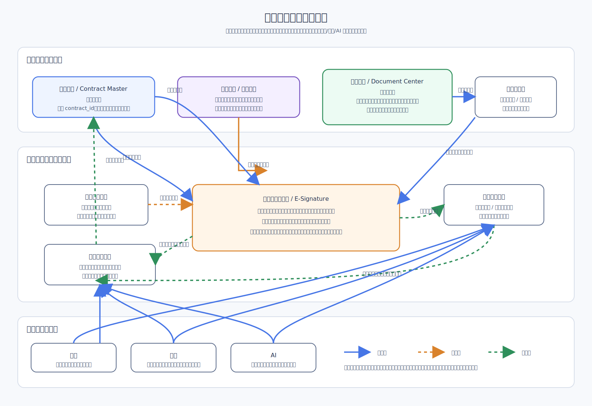

# 电子签章子模块 Architecture Design

## 1. 文档说明

本文档是 `CMP` 电子签章子模块的第一份正式 `Architecture Design`。
它用于收口电子签章在平台中的正式定位、边界、关键组件、主链路协作关系，
并明确其与合同主档、文档中心、流程引擎及周边底座能力的稳定挂接方式。

### 1.1 输入

- 上游需求基线：[`Requirement Spec`](../../../specifications/cmp-phase1-requirement-spec.md)
- 总平台架构：[`Architecture Design`](../../architecture-design.md)
- 合同管理本体架构：[`Architecture Design`](../contract-core/architecture-design.md)
- 文档中心架构：[`Architecture Design`](../document-center/architecture-design.md)
- 流程引擎架构：[`Architecture Design`](../workflow-engine/architecture-design.md)

### 1.2 输出

- 本文：[`Architecture Design`](./architecture-design.md)
- 后续接口边界文档：[`API Design`](./api-design.md)
- 后续内部实现文档：[`Detailed Design`](./detailed-design.md)
- 后续实施拆解文档：[`Implementation Plan`](./implementation-plan.md)

### 1.3 阅读边界

本文只回答“电子签章子模块如何在平台中成立、如何挂接、如何回写主链”。
不展开以下内容：

- 不写接口路径、请求字段、响应报文、回调协议与错误码
- 不写印章文件格式、签章坐标协议、证书介质格式与验签算法细节
- 不写内部表结构、任务主题、补偿参数、重试次数与存储实现细节
- 不写实施排期、负责人拆分、联调日程与工时估算

## 2. 子模块定位与设计目标

电子签章是 `CMP` 内部的正式业务子模块，不是依赖外部测试账号才能成立的接入壳。
它建立在审批通过后的正式合同主链之上，围绕同一 `contract_id` 承接签章申请、
签署编排、签章结果治理、验签结果治理与合同侧结果回写。

该子模块不拥有合同主档，也不拥有文件真相源。
它消费合同主档提供的业务上下文与文档中心提供的待签署文件，
并把签章结果回收到文档中心，再把签署摘要与时间线事件回写合同主档。

本子模块的设计目标如下：

- 让电子签章成为平台内正式能力，而不是外部系统阴影记录
- 让签章动作严格建立在审批通过后的正式合同主链上
- 让待签署文件与签章结果文件都纳入文档中心统一版本治理
- 让签章结果必须回写合同主档摘要、状态判断与时间线，而不是停留在模块私域
- 让默认审批主路径优先走 `OA` 的前提下，签章仍以平台审批结果为统一准入事实
- 让签章、验签、失败补偿、异常留痕都进入统一审计与恢复体系

## 3. 在总平台中的边界

### 3.1 子模块拥有的内容

- 签章申请与签署任务的模块内治理能力
- 印章权限分配、签章样式配置与签署策略的模块内治理能力
- 签署参与方、签署顺序、签署完成判断的运行时编排能力
- 验签结果、签署结果摘要与签章异常结果的专业状态治理能力
- 面向合同主档、文档中心、审计与通知的回写编排能力

### 3.2 子模块不拥有的内容

- 不拥有合同主档，不维护合同一级业务真相
- 不拥有待签署文件与签章结果文件的真相源，这些归文档中心治理
- 不拥有审批定义、审批实例与审批任务真相，这些归流程引擎与 `OA` 协同链路治理
- 不拥有归档主记录、搜索索引主记录或 AI 任务主记录
- 不允许绕开合同主档直接把签章结果解释为唯一生效事实

### 3.3 与总平台的关系判断

- 电子签章是平台正式子模块，挂载在合同主链、文档中心、权限、审计、通知、
  搜索、归档与 AI 底座之上
- 它回答“这份合同的签章过程如何发起、推进、完成、验真与回写”
- 它不回答“这份合同在业务上是谁”或“这份文件的正式版本链是什么”
- 它的所有关键结果都必须回到合同主档和文档中心，而不是只停留在自身模块

## 4. 关键组件划分

电子签章子模块在架构层按以下组件划分：

1. `Signature Request Gateway`
   负责接收来自合同主档的签章发起请求，并校验是否满足签章准入条件。
2. `Signature Policy Service`
   负责签章权限、签章样式、签署策略与签署约束的模块内治理。
3. `Signer Orchestrator`
   负责签署参与方编排、签署顺序控制、签署进度聚合与完成判定。
4. `Seal Control Service`
   负责印章资源、印章可用性、授权范围与调用约束治理。
5. `Signature Result Registry`
   负责签署结果、验签结果、失败原因、关键摘要与状态映射的统一登记。
6. `Contract Writeback Adapter`
   负责把签署摘要、完成时间、结果状态与关键事件回写合同主档与时间线。
7. `Document Writeback Adapter`
   负责把签章结果稿、验签产物引用或结果摘要回收到文档中心版本链。
8. `Security Audit Adapter`
   负责把签章关键动作、异常、权限校验结果和补偿动作接入平台审计链路。

这些组件只定义职责分区，不在本层写死类图、表设计、接口协议或任务编排参数。

## 5. 与合同主档的关系

电子签章与合同主档的关系是“签章专业状态围绕合同业务真相挂接”，
而不是“签章模块替代合同主档确认合同是否成立”。

关系原则如下：

- 合同主档是业务真相源，持有统一 `contract_id`、生命周期状态与业务摘要
- 电子签章通过 `contract_id` 绑定合同，只承接签章过程和签署结果专业语义
- 签章发起必须由合同主档或合同主链入口触发，不从独立签章台账反向生成合同事实
- 签章完成、签章失败、验签异常、签署撤销等关键结果必须回写合同主档摘要
- 合同时间线必须沉淀签章发起、签署完成、验签完成、异常中断等关键事件
- 合同是否进入“待签署 / 签署中 / 已生效”等业务判断，最终仍由合同主档统一解释

因此，电子签章可以拥有自己的过程状态，但不能拥有脱离合同主档的一级业务结论。

## 6. 与文档中心的关系

电子签章与文档中心的关系是“消费文件真相源并回收签章结果”，
而不是在签章模块内部再保存一套待签署文件和结果文件体系。

关系原则如下：

- 文档中心是文件真相源，持有待签署文件、签章结果稿与版本链
- 电子签章只读取文档中心指定版本作为正式签章输入稿
- 签章过程中的预览、定位、签章结果稿与验签相关文件引用都应回收到文档中心治理
- 文档中心负责文件版本链成立，电子签章负责签章业务语义成立
- 如签章结果回收失败，电子签章保留业务状态并进入补偿链路，但不能在模块内长期固化
  结果文件真相
- 电子签章不得绕过文档中心直接维护附件副本、结果稿副本或独立文件版本链

因此，待签署文件与签章结果文件都属于文档中心治理对象，电子签章只负责围绕它们
组织签署语义和结果回写。

## 7. 与流程引擎的关系

电子签章建立在审批通过后的正式合同主链上。
流程引擎与 `OA` 负责形成审批结果事实，电子签章消费这一事实作为准入前提，
但不反向拥有审批运行真相。

关系原则如下：

- 默认审批主路径优先走 `OA`，但签章准入判断统一以平台承接的审批结果为准
- 平台流程引擎仍是一期开箱可用的正式能力，签章子模块不能把审批前置条件只写成
  “等待外部系统”
- 审批未通过、已撤回、已终止或前置文件版本失效时，不得发起正式签章
- 签章完成后需要把关键结果反馈给流程摘要或后续业务链路，但不直接修改流程实例真相
- 审批链路和签章链路的异常都必须可区分治理，不能混成一个黑盒状态

因此，流程引擎负责审批真相，电子签章负责签章真相；两者通过合同主链和统一摘要联动。

## 8. 与加密、归档、搜索、AI 的关系

### 8.1 与加密的关系

- 电子签章消费的是文档中心受控文件对象，因此默认继承文档中心上的加密治理边界
- 待签署文件与签章结果稿在平台内应继续按受控读取方式使用，不绕开加密路径
- 管理端授权解密下载是文档中心与加密模块的治理边界，不由电子签章自行放开文件外发
- 签章过程涉及的关键文件读取、导出与异常都应进入统一审计

### 8.2 与归档的关系

- 电子签章完成后的正式签章结果是归档的重要输入，但归档主记录不归电子签章持有
- 归档模块消费合同主档摘要和文档中心中的签章结果稿，不直接消费电子签章内部过程表
- 电子签章只提供签署完成事实、结果摘要与文件引用，不替代归档封装与借阅治理

### 8.3 与搜索的关系

- 搜索消费合同主档摘要与文档中心中的受控文本，不以电子签章过程状态作为主索引真相
- 电子签章可输出“是否已签”“签署完成时间”等检索摘要，但索引刷新仍归平台搜索链路治理
- 验签结果、签章样式等专业细节应按需要投影为摘要，而不是把签章内部结构直接暴露为
  搜索主模型

### 8.4 与 AI 的关系

- AI 消费合同主档摘要、文档中心文件摘要和必要的签章结果摘要，用于问答、审查或提醒
- AI 不直接操纵签章结果，不越过签章模块生成法律效力结论
- 签章模块对 AI 只暴露受控摘要边界，不把内部签署过程细节作为默认开放上下文

## 9. 签章主链路

架构层的签章主链路如下：

1. 合同在主链上完成审批通过，平台形成统一审批通过事实。
2. 合同主档基于 `contract_id` 发起签章申请，并携带当前业务上下文。
3. `Signature Request Gateway` 校验合同状态、审批结果、签章权限与文件准入条件。
4. 电子签章从文档中心读取指定待签署版本作为正式输入稿。
5. `Signature Policy Service` 与 `Signer Orchestrator` 生成签署策略、参与方编排与执行顺序。
6. 签章过程推进，模块持续登记签署进度、验签结果与异常状态。
7. 签署完成后，`Document Writeback Adapter` 把签章结果稿和相关结果摘要回收到文档中心。
8. `Contract Writeback Adapter` 把签署状态、完成时间、结果摘要回写合同主档摘要与时间线。
9. 归档、搜索、AI 等周边能力再基于合同主档摘要和文档中心结果稿继续消费。

主链路的关键判断是：审批结果先成立，签章过程后成立；文件回收到文档中心，
业务结论回写合同主档。

## 10. 安全与扩展考虑

### 10.1 安全考虑

- 签章发起必须校验合同状态、审批通过事实、文件版本有效性与签章权限
- 印章授权、签署动作、验签结果、异常补偿和结果回写都必须纳入高等级审计
- 签章结果回写合同主档与文档中心时必须具备幂等控制，避免重复回写或乱序覆盖
- 文件读取、签章结果下载、异常导出等敏感动作必须受权限控制与受控日志保护
- 签章失败、验签失败、结果回收失败、回写失败不能静默丢失，必须进入补偿或告警链路

### 10.2 扩展考虑

- 后续扩展更多签署策略、签署方类型或验签规则时，不应破坏“合同主档是业务真相源、
  文档中心是文件真相源”的根约束
- 后续扩展更多签章样式、印章类型或法律规则时，应落在模块内策略边界，而不是污染合同
  主档和文档中心
- 后续扩展更多搜索、归档、AI 消费场景时，应继续以摘要投影方式挂接，而不是复制签章
  内部过程真相
- 如未来出现外部签章能力协同，也应经适配边界接入，不改写当前“平台内正式子模块”定位

## 11. 下沉边界

下列内容应继续下沉到该模块后续文档，而不在本文展开：

### 11.1 下沉到 `API Design` 的内容

- 签章申请、签章查询、验签查询、结果回收等接口边界
- 合同主档、文档中心、流程摘要之间的请求与响应对象
- 幂等键、回调鉴权、错误码与状态码口径

### 11.2 下沉到 `Detailed Design` 的内容

- 签章申请单、签署任务、印章授权、验签结果等内部模型与表结构
- 状态机细分、补偿机制、异步任务组织、事件主题与存储实现
- 文件版本引用、结果回收失败补偿、审计落库与权限校验细节

### 11.3 下沉到 `Implementation Plan` 的内容

- 建设阶段划分、联调顺序、依赖前置、验收里程碑与任务拆分
- 与合同主档、文档中心、流程引擎、归档、搜索、AI 的落地协同顺序
- 测试准备、联调清单、异常演练与上线切换安排

本文到此为止，保持在架构层回答“模块如何成立、边界如何收口、主链如何协作”，
不越界到接口、内部实现与实施计划层。
