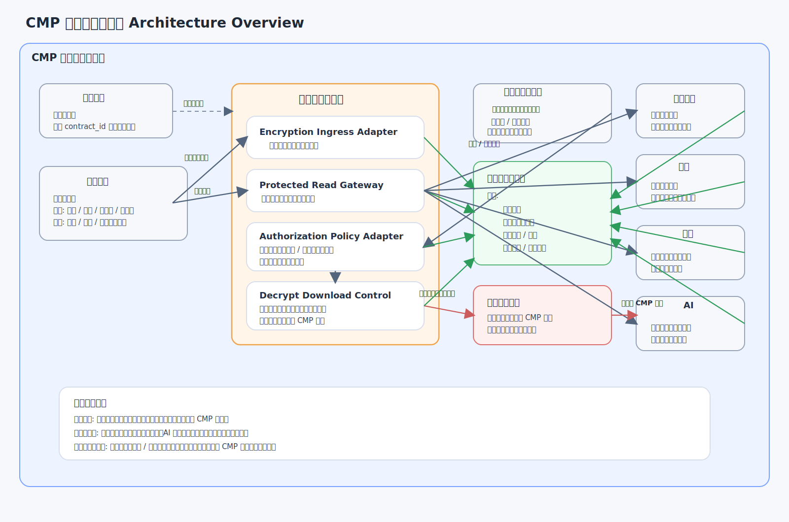

# 加密文档子模块 Architecture Design

## 1. 文档说明

本文档是 `CMP` 加密文档子模块的第一份正式 `Architecture Design`。
它用于收口加密软件作为平台内正式子模块的定位、边界、关键组件、
主链路协作关系，以及它与文档中心、合同主档、权限与审计、
管理端授权、签章、归档、搜索、AI 之间的稳定挂接方式。

### 1.1 输入

- 上游需求基线：[`Requirement Spec`](../../../specifications/cmp-phase1-requirement-spec.md)
- 总平台架构：[`Architecture Design`](../../architecture-design.md)
- 合同管理本体架构：[`Architecture Design`](../contract-core/architecture-design.md)
- 文档中心架构：[`Architecture Design`](../document-center/architecture-design.md)
- 电子签章架构：[`Architecture Design`](../e-signature/architecture-design.md)

### 1.2 输出

- 本文：[`Architecture Design`](./architecture-design.md)
- 配套架构图：[`encrypted-document-architecture.svg`](./encrypted-document-architecture.svg)
- 为后续该子模块 `API Design`、`Detailed Design`、`Implementation Plan`
  预留明确下沉边界

### 1.3 阅读边界

本文只回答“加密文档子模块如何在平台中成立、如何挂接、如何协作”。
不展开以下内容：

- 不写接口路径、请求字段、响应报文、错误码与回调协议
- 不写加密算法选型、密钥存储实现、任务主题、缓存键与表结构细节
- 不写解密下载审批流字段、导出包格式、前端页面交互与下载水印细节
- 不写实施排期、负责人拆分、联调顺序与工时估算

## 2. 架构图

## 3. 子模块定位与设计目标

加密文档子模块是 `CMP` 内部的正式能力子模块，不是外部对接系统，
也不依赖外部测试账号成立。它挂在文档中心的写入与读取路径上，
负责让正式文件进入文档中心后自动加密，并在平台内受控解密使用。

该子模块不拥有合同主档，也不拥有文件真相源。
合同主档仍然是业务真相源，文档中心仍然是文件真相源。
加密文档子模块围绕这两个既有真相源提供安全治理能力，
负责让文件在不改写真相归属的前提下满足“默认密文不可脱离 `CMP` 使用，
受控授权后可解密下载明文导出”的平台约束。

本子模块的设计目标如下：

- 让文件进入文档中心后自动进入加密治理，而不是依赖人工补做
- 让平台内读取正式文件时按权限自动解密使用，但不把明文外放当成默认行为
- 让管理端能够按部门、人员授予受控的“解密下载”权限
- 让解密下载后的导出明文文件可脱离 `CMP` 使用，但全过程必须受控并留痕
- 让签章、归档、搜索、AI 等模块既能消费加密后的正式文件，也能消费受控结果
- 让加密能力成为文档中心底座能力的一部分，而不是长出第二套文件系统

## 4. 在总平台中的边界

### 4.1 子模块拥有的内容

- 文档写入路径上的自动加密治理能力
- 平台内读取路径上的受控自动解密能力
- 解密下载授权的模块内策略承接与执行编排能力
- 解密下载行为的审计留痕、结果登记与异常记录能力
- 面向签章、归档、搜索、AI 等消费方的受控文件访问适配能力

### 4.2 子模块不拥有的内容

- 不拥有合同主档，不维护合同一级业务真相
- 不拥有文件对象、文件版本链与文件介质真相，这些归文档中心治理
- 不拥有部门、人员主数据真相，这些归平台组织与权限体系治理
- 不拥有签章、归档、搜索、AI 的主记录与业务结果真相
- 不允许绕过文档中心单独收文件、存文件或形成私有文件版本链

### 4.3 与总平台的关系判断

- 加密文档子模块是文档中心上的正式安全治理子模块，不是独立文件平台
- 它回答“文件如何自动加密、受控解密、受控下载与审计”
- 它不回答“合同在业务上是谁”或“文件正式版本是什么”
- 它的所有关键动作都必须围绕文档中心的文件对象和合同主档的业务上下文成立

## 5. 关键组件划分

加密文档子模块在架构层按以下组件划分：

1. `Encryption Ingress Adapter`
   负责挂接文档中心写入路径，执行入库前后的自动加密编排。
2. `Protected Read Gateway`
   负责挂接文档中心读取路径，校验平台内受控读取并执行自动解密使用。
3. `Authorization Policy Adapter`
   负责对接组织、权限与管理端授权策略，解释部门、人员级别的授权结果。
4. `Decrypt Download Control`
   负责受理受控解密下载请求，执行授权校验、结果封装与导出控制。
5. `Audit Trace Registry`
   负责登记加密、解密、授权、下载、失败与异常等关键安全事件。
6. `Capability Consumption Adapter`
   负责为签章、归档、搜索、AI 等模块提供一致的受控消费接入边界。
7. `Writeback Coordinator`
   负责把授权结果、下载结果、审计摘要与消费结果回写平台主链摘要。

这些组件只定义职责分区，不在本层写死类图、接口协议、表结构或任务编排参数。

## 6. 与文档中心的关系

加密文档子模块与文档中心的关系是“挂在文件真相源上的安全治理能力”，
而不是“替代文档中心管理文件”。

关系原则如下：

- 文档中心是文件真相源，负责文件对象、版本链与正式引用关系
- 加密文档子模块挂在文档中心写入 / 读取路径上，不绕开文档中心独立成立
- 文件一旦进入文档中心，就应自动进入加密治理链路
- 平台内读取文件时，由文档中心提供上下文，由加密子模块执行受控自动解密使用
- 签章、归档、搜索、AI 等模块消费文件时，也必须通过文档中心与加密边界协同读取
- 解密下载后的明文导出是受控例外结果，不反向替代文档中心中的正式文件真相

因此，文档中心持有文件真相，加密文档子模块持有安全治理语义；
两者协同，但不互相替代。

## 7. 与合同主档的关系

加密文档子模块与合同主档的关系是“围绕合同业务上下文施加文件安全约束”，
而不是“根据加密状态重定义合同业务状态”。

关系原则如下：

- 合同主档是业务真相源，持有统一 `contract_id`、生命周期与业务摘要
- 加密文档子模块通过合同上下文理解文件属于哪一份合同、当前处于什么业务场景
- 是否允许平台内查看、是否允许发起解密下载，必须结合合同上下文与用户权限判断
- 加密、解密、下载结果可以回写合同时间线或摘要事件，但不能替代合同主状态
- 解密下载是围绕正式业务上下文成立的受控动作，不是脱离合同主链的孤立下载能力

因此，合同主档决定业务语义，加密文档子模块决定该语义下的文件安全行为。

## 8. 与权限、审计、管理端授权的关系

### 8.1 与权限体系的关系

- 平台内自动解密使用必须建立在用户权限、业务上下文权限与文件访问权限之上
- 解密下载不因“能看见文件”而自动成立，必须额外命中解密下载授权边界
- 部门、人员授权是当前正式最小治理粒度，不应收口成笼统的角色开关

### 8.2 与管理端授权的关系

- 管理端是解密下载受控例外的正式授权入口
- 管理端必须支持按部门、人员授予“解密下载”权限
- 管理端授予的是例外授权，不应改变“默认密文不可脱离 `CMP` 使用”的主规则
- 管理端授权结果必须可追踪、可撤销、可审计

### 8.3 与审计体系的关系

- 文件加密入库、平台内解密使用、授权下发、授权命中、解密下载、导出完成、失败拒绝
  都必须纳入审计链路
- 审计留痕应至少覆盖触发主体、作用对象、业务上下文、动作结果与时间
- 审计记录是平台安全治理事实，不应散落在各消费模块的私有日志中

## 9. 与签章、归档、搜索、AI 的关系

### 9.1 与签章的关系

- 电子签章消费的是文档中心中的正式文件，默认经由加密边界受控读取
- 签章过程需要的平台内解密使用属于受控内部消费，不等于对外放出明文
- 签章结果稿回收到文档中心后，应继续进入同一加密治理体系

### 9.2 与归档的关系

- 归档模块读取归档输入集时，应消费文档中心中的正式文件与受控读取结果
- 归档稿、归档封包或归档介质引用回收至文档中心后，应继续受加密治理
- 归档记录属于归档模块真相，不归加密子模块持有

### 9.3 与搜索的关系

- 搜索消费的是文档中心文件对象及其派生文本或摘要，不以加密子模块为真相源
- 搜索链路需要使用明文内容时，应通过受控内部消费路径获取，而不是长期暴露平台外明文
- 搜索索引仍是读模型，加密子模块只约束其读取边界与审计要求

### 9.4 与 AI 的关系

- AI 消费正式文件时，应通过受控内部消费路径读取必要内容
- AI 可以消费加密后的正式文件或解密后的受控结果，但不能绕开权限直接访问明文
- AI 输出是辅助结果，不改变文件真相和授权真相归属

## 10. 加密 / 解密 / 解密下载主链路

### 10.1 文件写入自动加密主链路

1. 合同正文、附件、签章结果稿或归档稿进入文档中心写入路径。
2. `Encryption Ingress Adapter` 接收文档中心写入事件并挂接加密治理。
3. 文件在成为正式文档中心对象后自动进入加密处理。
4. 文档中心登记文件对象、版本关系与受控访问引用。
5. `Audit Trace Registry` 记录加密入库结果与异常结果。

### 10.2 平台内受控解密使用主链路

1. 合同详情、审批、签章、归档、搜索、AI 等平台能力发起文件读取请求。
2. 文档中心校验目标文件对象、版本与业务上下文。
3. `Protected Read Gateway` 结合权限与上下文执行平台内自动解密使用。
4. 消费方获得当前场景允许的预览、处理输入或下载流。
5. `Audit Trace Registry` 记录本次受控解密使用行为与结果。

### 10.3 管理端授权解密下载主链路

1. 管理端按部门、人员配置某类文件或业务范围内的解密下载授权。
2. 授权策略进入 `Authorization Policy Adapter` 的可解释边界。
3. 用户在正式业务上下文中发起解密下载请求。
4. `Decrypt Download Control` 校验用户权限、合同上下文与部门 / 人员授权结果。
5. 命中授权后，系统生成受控的解密下载结果。
6. 导出的明文文件可脱离 `CMP` 使用，但该结果只代表一次受控导出，不改变平台默认规则。
7. 授权命中、下载结果与失败原因统一写入 `Audit Trace Registry`，并按需要回写平台摘要。

## 11. 安全与扩展考虑

### 11.1 安全考虑

- 默认规则必须始终保持为“密文文档不可脱离 `CMP` 使用”
- 管理端授权解密下载是高敏受控例外，必须按部门、人员细粒度控制
- 平台内自动解密使用只服务受控内部场景，不能演化为普遍明文外发通道
- 加密、解密、下载、失败、拒绝、异常都必须留痕，且留痕应能回溯业务上下文
- 周边模块读取文件时不得绕开加密治理边界形成私有明文缓存真相

### 11.2 扩展考虑

- 后续扩展更多文件类型、更多消费模块或更多内部处理场景时，应继续复用同一加密治理主链
- 后续若增加更复杂的授权条件，也应建立在部门、人员授权主边界之上扩展，而不破坏当前主规则
- 后续若增加更多审计分析、风险识别与安全告警能力，应继续围绕统一审计事实挂接
- 后续若增加新的外部交换场景，也只能作为受控输出通道扩展，不能让外部场景反向成为平台文件真相源

## 12. 下沉到 API / Detailed / Plan 的内容边界

下列内容应继续下沉到该模块后续文档，而不在本文展开：

### 12.1 下沉到 `API Design` 的内容

- 文档中心写入回调、读取请求、授权查询、解密下载申请等接口边界
- 管理端授权配置对象、消费方读取对象与审计查询对象
- 鉴权方式、错误码、幂等键与状态映射口径

### 12.2 下沉到 `Detailed Design` 的内容

- 加密任务模型、授权规则模型、审计事件模型与内部状态机
- 加密处理器、解密处理器、缓存控制、导出封装与异常补偿实现细节
- 与文档中心、权限中心、审计中心之间的内部事件组织方式

### 12.3 下沉到 `Implementation Plan` 的内容

- 阶段划分、任务拆解、联调顺序、测试准备与上线安排
- 与文档中心、管理端、签章、归档、搜索、AI 的落地协同顺序
- 安全验证、异常演练、权限校验回归与审计验收安排

本文到此为止，保持在架构层回答“模块如何成立、边界如何收口、主链如何协作”，
不越界到接口、内部实现与实施计划层。
