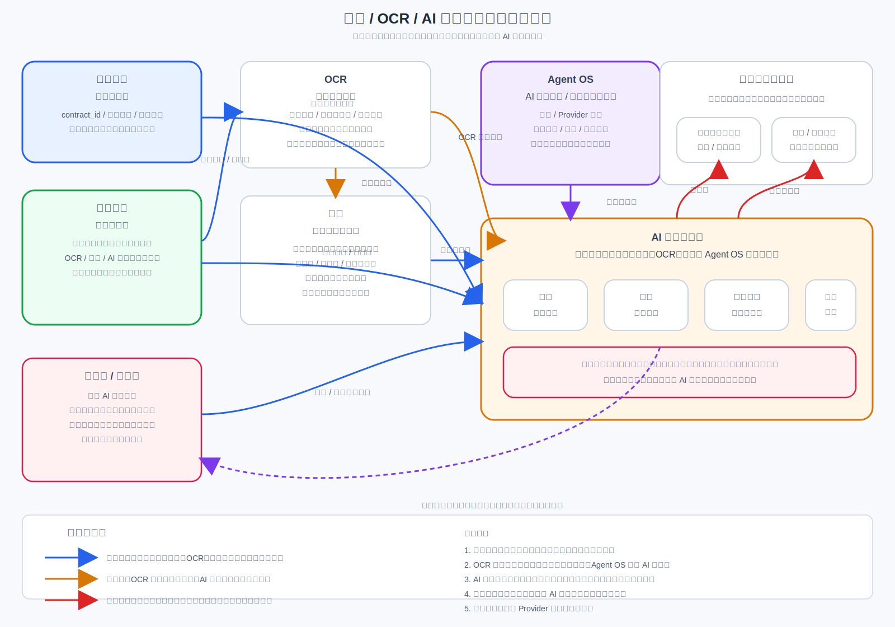

# 检索 / OCR / AI 业务应用主线 Architecture Design

## 1. 文档说明

本文档是“检索 / OCR / AI 业务应用主线”的第一份正式
`Architecture Design`。
它用于收口这条组合主线在平台中的定位、边界、能力分组、协作主链路与
后续下游文档边界。

这里不把搜索、`OCR`、AI 底座、AI 应用拆成多份并列正式文档，而是先回答：
这些能力如何作为业务应用层成立，并在不破坏合同主档、文档中心、
`Agent OS` 既有边界的前提下协同工作。

### 1.1 输入

- 上游需求基线：[`Requirement Spec`](../../../specifications/cmp-phase1-requirement-spec.md)
- 总平台架构：[`Architecture Design`](../../architecture-design.md)
- 总平台接口边界：[`API Design`](../../api-design.md)
- 总平台共享内部边界：[`Detailed Design`](../../detailed-design.md)
- 总平台实施骨架：[`Implementation Plan`](../../implementation-plan.md)
- 合同管理本体：[`Architecture Design`](../contract-core/architecture-design.md)
- 文档中心：[`Architecture Design`](../document-center/architecture-design.md)
- Agent OS：[`Architecture Design`](../../foundations/agent-os/architecture-design.md)

### 1.2 输出

- 本文：[`Architecture Design`](./architecture-design.md)
- 配套架构图：[`intelligent-applications-architecture.svg`](./intelligent-applications-architecture.svg)
- 为后续该主线 `API Design`、`Detailed Design`、`Implementation Plan`
  预留明确下沉边界

### 1.3 阅读边界

本文只回答“检索 / `OCR` / AI 业务应用主线如何在平台中成立并协同工作”。
不展开以下内容：

- 不写接口路径、字段明细、错误码、回调协议
- 不写向量库选型、索引参数、模型超参数、Prompt 模板细节
- 不写库表设计、任务主题、缓存键、消息编排细节
- 不写实施排期、里程碑、负责人拆分与工时估算

## 2. 架构图

## 3. 主线定位与设计目标

这条主线不是一个“AI 工具箱集合”，也不是把搜索、`OCR`、AI 各自独立建成
三个彼此松散的模块。
它是在平台中围绕合同业务场景成立的一条业务应用主线，负责把文件内容、
结构化识别、稳定检索与 AI 运行时能力编排成可落地的业务应用能力。

其核心定位如下：

- 以合同主档为业务真相源组织 AI 应用入口与结果归属
- 以文档中心为文件真相源组织 `OCR` 输入、检索输入与应用消费输入
- 以搜索承担稳定召回、筛选、排序与检索结果供给，不替代业务真相
- 以 `OCR` 把文件转成结构化结果与文本结果，不改写文件真相归属
- 以 `Agent OS` 承担 AI 运行时底座，不把某个模型或 Provider 写死成唯一方案
- 以 AI 业务应用消费受控结果，形成摘要、问答、风险识别、比对提取等业务能力

本主线的设计目标如下：

- 让检索、`OCR`、AI 业务应用围绕同一合同与同一文档对象协同，而不是各自建私有数据岛
- 让搜索成为稳定结果层，负责召回与排序，不被误用为第二份合同真相源或文件真相源
- 让 `OCR` 成为文件理解入口，把纸质稿、扫描稿、图片稿转成可治理结果
- 让 AI 应用只消费合同主档、文档中心、`OCR`、搜索与 `Agent OS` 的受控结果
- 让条款库成为合同 AI 的重要语义底座，服务问答、比对、风险识别与建议生成
- 让多语言成为正式约束，覆盖检索输入、语言归一、结果展示与 AI 输出边界
- 让结果回写收口到合同主档、文档中心引用和审计链路，而不是直接改写原始真相

## 4. 在总平台中的边界

### 4.1 本主线拥有的内容

- `OCR` 识别编排、识别结果治理与受控回收
- 检索索引、召回、筛选、排序、结果聚合与稳定结果输出
- 面向合同场景的 AI 业务应用编排与应用结果治理
- 共享的语言处理、语义对齐、结果评估、审计与结果投影能力

### 4.2 本主线不拥有的内容

- 不拥有合同主档，不定义合同一级业务真相
- 不拥有文件对象与文件版本链真相，不定义文件一级真相
- 不拥有 AI 底座运行时本体，这部分归 `Agent OS`
- 不把搜索索引、`OCR` 文本、摘要结果、问答缓存升级为正式业务真相源
- 不把某个模型 SDK、单一向量引擎或单一 Provider 升级为平台唯一依赖

### 4.3 与总平台的关系判断

- 合同主档回答“这份合同在业务上是谁、当前阶段是什么、结果归谁”
- 文档中心回答“这份合同相关文件是什么、当前可消费版本是什么”
- `OCR` 回答“文件里识别出了什么文本与结构化片段”
- 搜索回答“有哪些可稳定召回的候选结果、如何筛选与排序”
- `Agent OS` 回答“AI 任务如何运行、如何调用工具、如何审计与如何选择模型”
- AI 业务应用回答“如何把上述受控输入组织成业务上可用的摘要、问答、审查与提取结果”

## 5. 能力分组

### 5.1 搜索

搜索在本主线中的定位是“稳定检索结果层”，而不是“智能猜测层”。
它负责把合同、文档、条款与应用侧可检索结果组织为可召回、可筛选、可排序、
可追溯的结果集。

其职责如下：

- 接收来自合同主档、文档中心、`OCR`、条款库等正式来源的受控输入
- 建立合同级、文档级、条款级、应用结果级的检索入口
- 提供关键词检索、条件筛选、排序、分页、结果聚合与命中高亮
- 在多语言场景下处理语言识别、语言归一、语言维度筛选与结果展示
- 向 AI 业务应用提供稳定候选集，而不是直接产出业务结论

边界约束如下：

- 搜索索引是读模型，不是合同真相源
- 搜索索引是派生物，不是文件真相源
- 搜索结果可以辅助 AI，但不能替代 AI 应用中的业务判断与审计回写

### 5.2 OCR

`OCR` 在本主线中的定位是“文件理解入口”。
它负责把扫描件、图片件、非结构化文件输入转成后续可检索、可分析、可审查的
文本结果与结构化结果。

其职责如下：

- 从文档中心读取受控文件对象或受控版本
- 产出文本结果、版面结果、字段候选、段落片段与结构化提取结果
- 为搜索提供索引输入，为 AI 业务应用提供可引用上下文
- 为多语言文档提供语言识别、分段归属与后续语言处理基础

边界约束如下：

- `OCR` 结果是派生结果，不覆盖原文件
- `OCR` 失败不影响文档中心文件真相成立
- `OCR` 不拥有合同主档，也不拥有索引真相

### 5.3 AI 业务应用

AI 业务应用在本主线中的定位是“面向合同业务场景的应用层”。
它不等于 AI 底座，也不等于搜索或 `OCR` 本身。
它依赖合同主档、文档中心、`OCR`、搜索、条款库与 `Agent OS` 的协同供给，
在业务上形成正式可交付的应用能力。

当前架构层正式纳入的应用能力包括：

- 摘要
- 问答
- 风险识别
- 比对提取

与其紧密协同的底座与业务对象包括：

- 条款库
- 模板库
- 合同主档
- 文档中心
- 搜索
- `OCR`
- `Agent OS`

其职责如下：

- 按业务场景组装输入，而不是直接读取底层文件副本或模型 SDK
- 消费合同主档摘要、文档引用、`OCR` 结果、搜索候选集与条款库语义材料
- 通过 `Agent OS` 调度模型、工具、规则与审计链路
- 输出受控业务结果，并按场景回写摘要、风险标签、提取结果或应用记录

边界约束如下：

- AI 应用输出是辅助业务结果，不直接覆盖合同主档正式事实
- AI 应用不能绕过 `Agent OS` 直接把某个模型写死为唯一执行路径
- AI 应用不能绕过搜索稳定结果层直接把未经治理的原始召回当成正式结论

### 5.4 共享支撑层

为避免搜索、`OCR`、AI 业务应用各自重复建设，本主线需要一个共享支撑层。

共享支撑层至少包括：

- 语言识别与语言归一
- 术语映射与多语言标签治理
- 结果审计与可追溯引用
- 任务编排与异步处理挂接
- 结果质量评估与人工校验入口

它的作用不是形成新的业务中心，而是保证本主线内部协作方式稳定一致。

## 6. 与合同主档的关系

合同主档仍然是业务真相源。
本主线围绕同一 `contract_id` 组织应用能力，而不是长出第二份合同主档。

关系原则如下：

- AI 业务应用以合同主档作为业务归属、结果归档与回写锚点
- 搜索可索引合同摘要，但不能替代合同主档对业务状态的解释
- 摘要、风险识别、比对提取等结果可以回写合同主档摘要区或关联视图
- 问答、搜索命中、`OCR` 结果都只是辅助输入，不单独构成合同业务事实

因此，主线中的所有应用结果都必须围绕合同主档消费、展示与治理。

## 7. 与文档中心的关系

文档中心仍然是文件真相源。
本主线中的 `OCR`、搜索与 AI 应用，都必须围绕文档中心的正式文件对象工作。

关系原则如下：

- `OCR` 的输入来自文档中心受控版本
- 搜索的文档文本输入来自文档中心及其派生结果
- AI 应用引用的正文、附件、扫描件、识别片段都应回指文档中心对象
- 本主线不能独立缓存一套“应用专用文件库”作为长期正式来源

因此，文档中心提供输入真相与引用坐标，本主线提供理解、检索与应用消费能力。

## 8. 与 Agent OS 的关系

`Agent OS` 仍然是 AI 能力底座与运行时操作系统。
本主线不替代 `Agent OS`，而是在业务应用层消费它的运行时能力。

关系原则如下：

- AI 业务应用通过 `Agent OS` 发起模型调用、工具调用、任务编排与审计留痕
- 搜索与 `OCR` 可以作为 `Agent OS` 的工具能力或受控输入能力被 AI 应用消费
- 模型 / Provider 选择、降级、切换与审计不在本主线写死
- 本主线只定义应用层如何使用 AI 运行时，不定义 AI 底座内部实现细节

因此，`Agent OS` 是运行时底板，本主线是业务应用装配层。

## 9. 与条款库 / 模板库 / 摘要 / 问答 / 风险识别 / 比对提取的关系

### 9.1 与条款库的关系

- 条款库是后续合同 AI 的重要底座
- 条款库为问答 grounding、标准条款比对、风险识别、偏差解释提供语义参照
- 条款库可被搜索索引与 AI 应用共同消费，但条款库本身仍由合同管理本体归口

### 9.2 与模板库的关系

- 模板库为摘要、问答、风险识别、比对提取提供标准合同结构背景
- 模板库帮助 AI 应用理解“应有结构”，但不直接替代合同实例

### 9.3 与摘要的关系

- 摘要是 AI 业务应用的正式能力之一
- 摘要可消费合同主档、文档中心、`OCR`、搜索与条款库结果
- 摘要结果可回写合同视图摘要区或应用结果区，但不能替代合同主档主字段

### 9.4 与问答的关系

- 问答必须基于受控范围内的合同主档、文档中心、`OCR`、搜索与条款库结果
- 问答回答应保留引用依据，不应脱离正式来源自由发挥
- 多语言问答应支持输入理解、跨语言召回与统一术语输出

### 9.5 与风险识别的关系

- 风险识别基于条款库、模板库、合同文本、`OCR` 结果与搜索候选集协同完成
- 风险识别结果是辅助结论，需要保留证据、规则依据或引用片段
- 风险标签可回写合同风险视图，但不应自动改写合同主状态

### 9.6 与比对提取的关系

- 比对提取包括字段提取、条款提取、差异比对与结构化对照
- 比对提取需要同时依赖文档中心文件、`OCR` 结果、模板结构和条款库语义
- 提取结果可形成业务读模型或待确认结果，但不应直接成为唯一正式源

## 10. 检索 / OCR / AI 业务应用主链路

### 10.1 文件进入与识别链路

1. 文档进入文档中心并成为受控文件对象。
2. `OCR` 从文档中心读取目标版本，输出文本结果与结构化结果。
3. `OCR` 结果回收到本主线的受控结果域，并回指原始文件对象。

### 10.2 索引与检索链路

1. 搜索消费合同主档摘要、文档中心引用、`OCR` 文本与条款库内容。
2. 搜索建立合同级、文档级、条款级索引与过滤能力。
3. 用户或 AI 应用发起检索时，搜索返回稳定候选集、筛选结果与排序结果。

### 10.3 AI 应用执行链路

1. 业务场景发起摘要、问答、风险识别或比对提取诉求。
2. AI 应用先读取合同主档业务上下文，再拉取文档中心引用、`OCR` 结果、
   搜索候选集、条款库 / 模板库材料。
3. AI 应用通过 `Agent OS` 调度模型、工具、规则与审计。
4. AI 应用生成业务结果，并附带引用依据、风险提示或候选差异。

### 10.4 结果回写链路

1. 摘要、风险识别、提取结果按业务规则回写合同主档关联视图或应用结果区。
2. 需要沉淀的引用、片段、证据链继续回指文档中心与搜索结果。
3. 全部 AI 应用结果进入审计链路，保留输入来源、执行方式与回写动作。

## 11. 安全与扩展考虑

### 11.1 安全考虑

- AI 应用只能消费受控输入，不能绕过权限直接读取底层文件或合同数据
- 多语言处理应受术语、权限与显示策略约束，避免跨语言误解扩散
- `OCR` 文本、搜索结果、AI 结果都应保留来源引用与审计留痕
- 高风险应用结果如风险标记、关键字段提取、重要摘要回写，应保留人工确认入口
- 结果缓存、检索快照、问答会话都不得演变为新的正式真相源

### 11.2 扩展考虑

- 后续可增加更多 AI 应用，但仍应复用合同主档、文档中心、搜索、`OCR`、
  `Agent OS` 这组稳定边界
- 后续可替换模型、Provider、索引引擎或识别引擎，但不改变主线职责划分
- 后续可增加更多语言与术语治理能力，但不能破坏统一业务真相与文件真相边界
- 后续可增加条款知识增强、模板增强、审查增强能力，但仍应围绕条款库与模板库
  的正式归口协同

## 12. 需要下沉到后续 API / Detailed / Plan 的内容边界

### 12.1 下沉到后续 `API Design` 的内容

- `OCR` 提交、结果查询、重试与人工校验接口边界
- 搜索查询、筛选、排序、结果分页与高亮返回协议
- 摘要、问答、风险识别、比对提取等应用接口边界
- 应用结果回写、状态标记、审计查询与权限校验接口

### 12.2 下沉到后续 `Detailed Design` 的内容

- 索引模型、语言处理链、识别结果模型、应用结果模型
- 搜索召回策略、排序策略、结果融合策略与缓存策略
- `OCR` 任务编排、失败恢复、人工校验与质量评估细节
- AI 应用的任务拆解、上下文装配、工具调用与结果校验细节

### 12.3 下沉到后续 `Implementation Plan` 的内容

- 阶段建设顺序与优先级
- 应用能力一期 / 后续期划分
- 联调、验收、灰度与培训安排
- 资源投入、排期与风险缓解计划

### 12.4 明确不在本文展开的内容

- 不在本文固化具体模型名称、Provider 名称、向量库名称或识别引擎版本
- 不在本文定义接口字段、库表字段、消息字段或页面交互细节
- 不在本文展开实施排期与任务拆解
