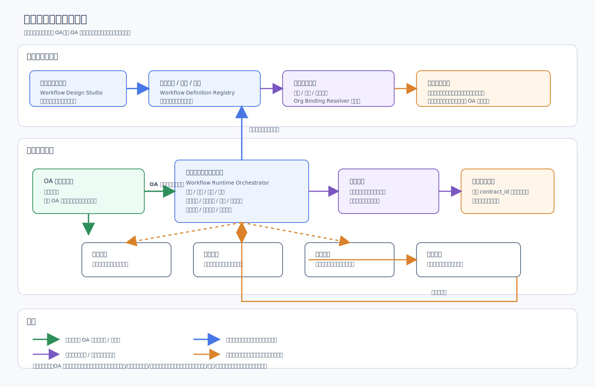

# 流程引擎子模块 Architecture Design

## 1. 文档说明

本文档是 `CMP` 流程引擎子模块的第一份正式 `Architecture Design`。
它在总平台文档约束下，收口流程引擎子模块的定位、边界、
组件划分、运行时协作关系与后续下游文档边界。

### 1.1 输入

- 上游需求基线：[`Requirement Spec`](../../../specifications/cmp-phase1-requirement-spec.md)
- 总平台架构：[`Architecture Design`](../../architecture-design.md)
- 总平台接口边界：[`API Design`](../../api-design.md)
- 总平台共享内部边界：[`Detailed Design`](../../detailed-design.md)
- 总平台实施骨架：[`Implementation Plan`](../../implementation-plan.md)

### 1.2 输出

- 流程引擎子模块的正式架构定位与边界说明
- 流程引擎子模块与 `OA`、组织架构、合同主档、审计、通知、
  任务中心等平台能力的协作关系
- 后续该子模块 `API Design`、`Detailed Design`、
  `Implementation Plan` 的下沉范围边界

### 1.3 阅读边界

本文只回答“流程引擎子模块如何在平台中成立并协作”。
不展开以下内容：

- 不写接口路径、请求字段、响应结构、错误码
- 不写内部表设计、状态机枚举、任务重试参数
- 不写节点 DSL、表达式语法、画布协议、前端交互细节
- 不写实施排期、里程碑、工时、负责人拆分

## 2. 架构图

## 3. 子模块定位与设计目标

流程引擎子模块是 `CMP` 内部的正式业务子模块，负责承接平台内
审批流定义、发布、实例运行、任务推进与协同治理能力。
它不是 `OA` 的回调适配器，也不是只在极端情况下临时启用的备用壳层。

本子模块的设计目标如下：

- 一期内形成完整审批流引擎能力，而不是只保留接口预留
- 保持 `OA` 作为默认主审批路径，同时保证平台具备正式承接能力
- 让审批节点始终落到组织架构中的部门、人员或组织规则，
  避免脱离组织主数据的空节点
- 让流程状态与合同主档解耦治理，但通过 `contract_id` 建立稳定绑定
- 统一接入审计、通知、任务中心与异常处理能力，保证审批运行可追踪、
  可恢复、可运营
- 为后续更细的接口、详细设计与实施拆解预留清晰下沉边界

## 4. 在总平台中的边界

### 4.1 子模块拥有的内容

- 流程定义与版本发布能力
- 节点编排与路由规则的模块内治理能力
- 流程实例、审批任务、审批动作的运行时治理能力
- 催办、时限控制、转办、异常承接等审批运行控制能力
- 面向平台管理端的可视化配置承载能力

### 4.2 子模块不拥有的内容

- 不拥有合同主档，不维护合同一级真相源
- 不拥有组织架构主数据，只消费组织与权限底座
- 不拥有统一审计、统一通知、统一任务中心的横切真相源
- 不替代 `OA` 的系统内审批体验与原生数据模型
- 不承担外围系统本体改造职责

### 4.3 与总平台的关系判断

- 流程引擎是平台正式子模块，挂载在平台统一认证、权限、审计、
  通知、任务与集成底座之上
- 流程引擎产生的审批结果属于平台正式业务事件，必须可回写合同主档
  状态与时间线
- 外部 `OA` 回传的审批结果属于外部事实输入，不改变平台对流程定义、
  承接状态和合同业务上下文的治理责任

## 5. 关键组件划分

流程引擎子模块在架构层按以下组件划分：

1. `Workflow Design Studio`
   负责流程可视化配置、节点编排、组织绑定配置、发布前校验。
2. `Workflow Definition Registry`
   负责流程定义、版本、发布态与启停态管理。
3. `Workflow Runtime Orchestrator`
   负责实例启动、节点推进、路由判定、并行聚合、会签控制、
   转办处理与异常收敛。
4. `Workflow Task Manager`
   负责审批任务生成、分发、待办视图映射、催办与超时控制。
5. `Org Binding Resolver`
   负责把节点绑定的部门、人员或组织规则解析为可执行参与人集合。
6. `OA Routing Gateway`
   负责默认主审批路径下的 `OA` 发起、状态同步、结果接收与路径切换判断。
7. `Workflow Collaboration Adapter`
   负责与合同主档、审计日志、通知中心、任务中心、文档中心等模块对接。

这里的组件划分只定义职责分区，不在本层写死类图、表结构、
队列主题或服务接口形态。

## 6. 与 `OA` 的关系

`OA` 与流程引擎子模块的关系应按“双路径、主次分明、平台治理不丢失”
理解：

- 默认情况下，主审批路径优先走 `OA`
- 流程引擎子模块仍是一期正式建设项，不能降级为桥接层附属物
- 当 `OA` 无法满足审批规则复杂度、并行/会签控制、组织选人方式、
  时限控制、转办要求或异常承接要求时，由平台流程引擎正式承接
- 平台必须保留流程定义、承接策略、实例摘要、结果回写和审计留痕的
  治理能力，不能把审批治理权整体外包给 `OA`

因此，`OA` 是默认执行优先路径，但不是流程能力唯一归属方；
流程引擎子模块是平台内审批能力的正式主体。

## 7. 与组织架构绑定的关系

流程引擎的每一个审批节点都必须绑定组织架构中的部门、人员或组织规则。
这是该子模块成立的核心约束之一。

绑定关系在架构层的原则如下：

- 节点不能只配置抽象审批角色而不落组织主数据
- 节点绑定来源统一来自平台组织与权限底座
- 节点可直接绑定部门
- 节点可直接绑定人员
- 节点可绑定组织规则，由运行时解析成候选参与人
- 组织解析结果需要受权限、在岗状态、组织归属与可执行性约束

流程引擎消费组织数据，但不复制组织主数据为自己的独立主档。
组织变更会影响节点参与人解析结果，但组织变更治理仍归平台组织底座负责。

## 8. 与合同主档、审计、通知、任务中心的关系

### 8.1 与合同主档的关系

- 流程引擎不拥有合同主档
- 流程实例通过 `contract_id` 绑定业务对象
- 审批启动、审批完成、驳回、撤回、终止等关键结果必须回写合同业务状态
  或合同时间线
- 合同详情页需要能读取流程摘要，但流程摘要不等于合同主档本身

### 8.2 与审计日志的关系

- 流程定义发布、启停、节点配置变更属于关键审计事件
- 审批动作、转办、催办、超时、异常处理属于关键审计事件
- `OA` 同步失败、状态回写失败、组织解析失败等异常需纳入审计链路

### 8.3 与通知中心的关系

- 待审批、抄送、催办、超时、退回、异常告警等消息由通知中心统一分发
- 流程引擎定义“何时通知”，通知中心负责“通过什么通道通知”
- 通知结果回执属于流程运行可观测输入，但不由流程引擎自建消息通道

### 8.4 与任务中心的关系

- 审批待办、已办、抄送、催办、超时处理等运行控制需要与任务中心协作
- 流程引擎负责生成业务任务语义，任务中心负责统一任务承载、查询、
  调度与恢复
- 异步催办、超时扫描、异常重试等能力应复用平台任务中心，不单独长出
  第二套任务执行体系

### 8.5 与文档中心的关系

- 流程引擎在审批过程中可引用合同正文、附件与批注信息
- 文档对象真相仍归文档中心，不归流程引擎
- 文档变更对审批的影响由平台规则协调，不在架构层默认写成流程引擎私有逻辑

## 9. 运行时主链路

运行时主链路在架构层分为两条。

### 9.1 `OA` 主审批路径

1. 合同业务在平台内满足发起条件。
2. 平台根据承接策略判断当前流程优先走 `OA`。
3. 流程引擎子模块输出流程摘要、参与人映射与业务关联信息。
4. `OA Routing Gateway` 发起 `OA` 审批实例。
5. `OA` 执行主审批流转并回传关键状态。
6. 平台接收回传结果，更新流程摘要、审计记录、通知与任务状态。
7. 审批结果按 `contract_id` 回写合同状态与时间线。

### 9.2 平台流程引擎承接路径

1. 合同业务在平台内满足发起条件。
2. 平台根据承接策略判断 `OA` 不满足当前审批场景。
3. 运行时加载已发布流程定义与节点组织绑定。
4. `Org Binding Resolver` 解析节点参与人。
5. `Workflow Runtime Orchestrator` 创建流程实例并生成审批任务。
6. 审批人在平台内完成串行、并行、会签、转办等动作。
7. 任务中心承接催办、超时扫描、异常恢复等异步控制。
8. 审计日志、通知中心持续接收运行事件。
9. 最终审批结果按 `contract_id` 回写合同状态与时间线。

### 9.3 统一状态回写原则

- 无论主路径来自 `OA` 还是平台流程引擎，最终都要回到平台合同主档
- 平台必须形成统一审批摘要，避免前台只能去外部系统追状态
- 状态回写失败属于平台异常事件，必须进入审计与补偿链路

## 10. 安全与扩展考虑

### 10.1 安全考虑

- 节点组织绑定必须受组织权限和数据权限约束，避免错误选人
- 流程配置发布、节点变更、承接路径切换必须纳入高等级审计
- 审批动作、转办、催办、异常恢复等关键动作必须可追踪、可回放
- 与 `OA` 的状态交换必须保证幂等、签名校验、回调可信与重复处理控制
- 任务超时、通知失败、状态回写失败不能静默丢失，必须进入告警或补偿

### 10.2 扩展考虑

- 扩展新节点类型时，不应破坏当前节点绑定组织架构的统一约束
- 扩展新路由策略时，应保持流程定义与运行时解耦
- 扩展更多通知渠道时，应经通知中心承接，而不是让流程引擎直连渠道
- 扩展更多业务对象时，应复用 `contract_id` 风格的业务绑定思想，
  而不是让流程引擎拥有业务主档
- 若后续审批量上升，优先扩展运行时与任务处理能力，不先把模块边界改写成
  分布式拆分前提

## 11. 下沉到后续文档的内容边界

### 11.1 下沉到该模块 `API Design` 的内容

- 流程定义、发布、启停、查询等接口资源边界
- 流程实例、任务、审批动作、催办、转办等接口资源边界
- `OA` 桥接接口、回调接口、查询接口的模块级契约
- 管理端可视化配置保存与发布的对外接口契约

### 11.2 下沉到该模块 `Detailed Design` 的内容

- 流程定义模型、节点模型、绑定模型、实例模型、任务模型
- 路由判定、并行聚合、会签策略、转办规则、异常处理的内部设计
- 组织解析、任务生成、时限控制、补偿机制的内部实现
- 模块级时序图、状态机、主表与索引边界

### 11.3 下沉到该模块 `Implementation Plan` 的内容

- 模块开发阶段划分
- 与 `OA` 联调、组织数据联调、通知与任务中心联调安排
- 配置端、运行时、回写链路、异常处理、验收准备的任务拆分
- 风险、依赖、排期与交付顺序

### 11.4 不应继续留在本架构文档中的内容

- 具体接口字段与错误码
- 具体库表、索引、事务与锁策略
- 具体画布协议、表达式语法、节点属性定义
- 具体开发排期与资源分配

## 12. 本文结论

流程引擎子模块在一期是平台内正式成立的审批能力子模块。
它与 `OA` 的关系不是替代一切，也不是依附一切，而是
“默认主路径优先走 `OA`，平台流程引擎保持正式承接能力并统一纳入
组织、合同、审计、通知、任务等平台治理体系”。

本文到此为止只收口模块架构边界，不继续下沉到接口、内部实现或实施计划。
